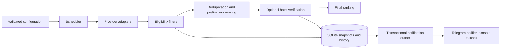

# Travel Deal Agent

A local Python application for finding travel deals that match a configurable budget,
trip length, departure airport and hotel-quality criteria. It remembers prices and
avoids repeating alerts for the same trip.

**Status:** offline mock by default, with opt-in ITAKA booking-price checks (manual `--force`, or continuous `--watch` once deliberately enabled), an enabled and live-tested Wakacje.pl listing provider (HTTP-only, no Playwright), and a Rainbow browser listing provider that is **blocked by source policy** (`r.pl/robots.txt` disallows the `/szukaj` search path the production flow needs) and stays disabled and CLI-rejected under `--watch`. Unverified variants remain diagnostic. TUI and Google are not connected; no paid API is used. Alerts are delivered through the official Telegram Bot API by default, falling back to local console logging when Telegram credentials are not configured. The repository includes a CI workflow but does not require GitHub to run.

## Problem and approach

Travel offers differ in price presentation, hotel-rating scales and trip details.
Manual comparison is repetitive, and repeatedly checking the same deal can generate
noisy notifications. This project separates source adapters from eligibility rules,
ranking, scheduling and persistence so each part can be tested without a live website.

## Architecture



| Module | Responsibility |
| --- | --- |
| `config.py`, `config_types.py` | Typed JSON contracts, environment overrides and startup validation |
| `models.py` | Dataclass offer model, Decimal prices and conservative duplicate identity |
| `providers/` | Source interfaces, factory registry, mock, bounded ITAKA HTML diagnostics and external-rating placeholder |
| `filtering.py`, `ratings.py` | Pure eligibility rules and native-scale normalization |
| `ranking.py`, `presentation.py` | Weighted comparison and rating display |
| `pipeline.py` | Filter, shortlist, enrich and persist observations |
| `scheduler.py` | Per-source due times, retry backoff and injected clocks |
| `active_hours.py` | Pure configurable local time-of-day window gating provider scans |
| `alerts.py` | Pure new-offer, returning-offer and price-drop decisions |
| `storage.py` | SQLite snapshots, history, schedules and transactional outbox |
| `notifications.py` | Delivery interface, Telegram Bot API notifier and local logging implementation |
| `notification_content.py` | Transport-independent message content from persisted alert snapshots |

### Design choices

- Standard-library dataclasses model offers; TypedDict describes configuration and
  serialized records. Pydantic validates JSON at the boundary without introducing an ORM.
- Decimal avoids floating-point monetary comparisons. SQLite stores monetary values
  as decimal strings and creates the snapshot and alert in one transaction.
- Providers, notification delivery, clocks and external hotel verification are injected.
  New sources need an adapter, a registry entry and configuration, not scheduler changes.
- Broad exception handling is limited to adapter/delivery boundaries, with tracebacks
  logged. Storage failures propagate instead of being mistaken for bad source data.
- A sequential scheduler is sufficient for a small local application. No web framework,
  message broker or distributed task queue is required.

## Technologies

Python 3.10+, SQLite, dataclasses, Pydantic, python-dotenv, Playwright, pytest, Ruff and mypy.
Active hours use the standard-library `zoneinfo` module; `tzdata` is an additional
dependency only on Windows, which (unlike most Linux distributions) has no built-in IANA
time zone database for `zoneinfo` to read.
The GitHub Actions configuration runs checks on Windows and Linux with Python 3.10/3.14.

## Quick start

Open a terminal in the project directory. On Windows PowerShell:

```powershell
py -m venv .venv
.\.venv\Scripts\python.exe -m pip install -r requirements-dev.txt
Copy-Item .env.example .env
.\.venv\Scripts\python.exe -m travel_deal_agent --force
```

Skip environment creation if `.venv` already exists. Copy `.env.example` only during
first setup; preserve existing settings. Runtime-only installations can use
`requirements.txt` instead of `requirements-dev.txt`.

On Linux/macOS, use `python3 -m venv .venv` and `.venv/bin/python` for the commands above.

To run continuously:

```powershell
.\.venv\Scripts\python.exe -m travel_deal_agent --watch
```

Stop with Ctrl+C. Keep the terminal open and computer awake. A regular single check
(without flags) respects saved due times; `--force` bypasses them for one manual run.
Do not run multiple scheduler instances against the same database.

## Configuration

Edit `config.json` and restart. Environment overrides in `.env` control
`TDA_CONFIG`, `TDA_DATABASE` and `TDA_LOG_LEVEL`; operating-system variables take precedence.
Relative paths resolve from the project root. Secrets belong only in environment
variables or `.env`, which is ignored by Git. Generated databases and logs are also ignored.

The initial policy is:

- Exactly 2 travelers. Stay length is currently unrestricted (`filters.min_nights` and
  `filters.max_nights` are both `null` in production); set either to a positive integer
  number of nights to re-enable that bound without a code change. Nights are always
  computed as `return_date - departure_date`, the one stay-length signal that means the
  same thing for every provider -- never from the provider-specific `Offer.number_of_days`
  (ITAKA/Rainbow count touroperator "dni" = nights + 1; Wakacje.pl/TUI count nights directly).
- At most 1500 PLN **per person**, inclusive; total party price is not the budget field.
- LCJ > WAW/WMI (equal) > KTW > WRO departures.
- At least 3 hotel stars (`filters.min_stars`), the same for every country. There is no
  country whitelist: an offer is never rejected only because its source country has no
  mapped ISO code (such an offer keeps `country` empty and shows the source's country name
  in its destination).
- Missing information needed by a hard filter rejects the offer. Missing Google data does not.

| Source ID | Native scale | Below 1000 PLN/person | 1000–1500 PLN/person |
| --- | --- | --- | --- |
| `rainbow` | 0–6 | 5.0 minimum | 5.0 minimum |
| `itaka` | 1–6 | 4.0 minimum | 5.0 minimum |
| `wakacje.pl` | 0–10 | 8.0 minimum (single threshold) | 8.0 minimum (single threshold) |
| `mock` | 0–10 | Rating filter disabled | Rating filter disabled |

These are configured project requirements. The current board whitelist is HB, FB, AI and ZO
("Według programu" -- Wakacje.pl's itinerary-based board, service code 5, accepted as a
normal canonical board but never treated as better than HB/FB/AI); other meal types require
an explicit configuration change even if a price band allows them.
Price bands use inclusive lower bounds and exclusive upper bounds unless
`max_inclusive: true` is set. Bands must be ordered and non-overlapping. Add more bands
without changing the filtering code. A rule may instead set one price-independent
`min_rating` with empty `price_bands` (Wakacje.pl uses `min_rating: 8`); a rule cannot use
both. Unknown source IDs and uncovered price bands fail
an enabled rating filter.

Ranking weights cover price, airport, native rating, native review count, stars, Google
rating, Google review count and meal quality. Native scales normalize with
`100 * (value - minimum) / (maximum - minimum)`. Review counts use a logarithmic score
with a configurable cap; star normalization is configurable too.

`external_verification` selects a configurable number of top candidates **after** hard
filters, deduplication and preliminary ranking. It is disabled by default. Google and Tripadvisor
adapters are placeholders: enabling the flag alone makes no network requests. Each future
implementation must return a confidently matched hotel, rating, review count and optional
location/place ID. Ambiguous matches return no data. Example presentation:

```text
ITAKA: 5.3/6 | Google: 4.4/5 | Tripadvisor: 4.5/5
ITAKA: 5.3/6 | Google: brak danych | Tripadvisor: 4.5/5
```

Each source has its own polling cadence. Setting `interval_min_seconds` and
`interval_max_seconds` on a provider draws a fresh random delay from that range after
every *successful* cycle (`next_run = now + uniform(interval_min_seconds,
interval_max_seconds)`), avoiding a perfectly periodic schedule while spreading real
requests out over time — this is not a mechanism for evading a site's protections.
Equal bounds give an exact interval and skip the random draw. A provider without both
fields configured keeps using its plain `interval_seconds` exactly as before; this is
a backward-compatible fallback, not a deprecated field, and a config with only one of
the two range fields set is rejected at startup. A failed cycle always uses the
existing deterministic exponential backoff (`interval_seconds * 2**failures`, capped by
`scheduler.max_backoff_exponent`) regardless of any configured range, so retry timing
after an error is never randomized. Each source's own `robots.txt`, crawl-delay,
`request_gap_seconds` and `cycle_seconds` request budget are independent, lower-level
protections that this scheduler-level range never loosens; a source that needs a more
cautious cadence can simply configure a larger range. The mock's `interval_seconds`
defaults to 600, which is not a recommended interval for real websites. Scheduler idle
polling is configurable too.

### Active hours

`active_hours` restricts provider scans (in both a single check and `--watch`) to a
configurable local time-of-day window, so the agent can be left running continuously
without polling sources while nobody can act on an alert:

```json
"active_hours": {
  "enabled": true,
  "timezone": "Europe/Warsaw",
  "active_from": "07:00",
  "active_until": "23:30"
}
```

`active_from` is inclusive and `active_until` is exclusive, matching the price-band
convention used elsewhere in this configuration. A window may wrap past midnight (for
example `"22:00"`/`"06:00"`). `timezone` accepts any IANA name resolvable by the
standard-library `zoneinfo` module. Setting `enabled` to `false` disables the gate
(scans run at any hour), without a code change. `--force` bypasses the gate for one
manual check, exactly like it already bypasses each provider's due time.

Outside active hours, `run_forever` keeps running and waiting (`scheduler.idle_poll_seconds`
between checks) instead of scanning; it never sends a notification about being idle. Each
provider's own persisted due time (`interval_seconds`, or the randomized range above) is
untouched while scans are skipped, so entering active hours triggers exactly one normal
check per due provider, not a burst covering every interval missed overnight.

## Automatyczne uruchamianie na Windows (Task Scheduler)

Ta sekcja pokazuje, krok po kroku, jak sprawić, żeby Travel Deal Agent uruchamiał się sam
po zalogowaniu do Windows i działał w tle w trybie `--watch` — bez otwierania VS Code, bez
terminala i bez żadnego dodatkowego pliku pomocniczego (`.bat`/`.cmd`/`.ps1`). Windows
Task Scheduler potrafi uruchomić program bezpośrednio.

Instrukcja zakłada dokładnie taki układ folderów, jaki jest w tym repozytorium:

- folder projektu: `C:\Projects\travel-deal-agent`
- środowisko wirtualne już utworzone w: `C:\Projects\travel-deal-agent\.venv`

Jeśli projekt znajduje się w innym miejscu na Twoim komputerze, wszędzie poniżej zamień
`C:\Projects\travel-deal-agent` na swoją rzeczywistą ścieżkę.

### Dlaczego używamy `pythonw.exe`, a nie `python.exe`

Każde środowisko wirtualne (`.venv`) utworzone na Windows zawiera dwa programy:
`python.exe` (otwiera czarne okno konsoli) i `pythonw.exe` (ten sam Python, ale bez okna).
Używając `pythonw.exe`, agent działa całkowicie w tle — nie zobaczysz żadnego okna, nawet
na pasku zadań. Nie wpływa to na logowanie: aplikacja i tak zapisuje wszystko do pliku
(patrz sekcja o logach niżej).

### Dlaczego pole "Start in" jest konieczne

Ten projekt **nie jest zainstalowany jako pakiet Pythona** — uruchamiamy go poleceniem
`python -m travel_deal_agent` bezpośrednio z folderu ze źródłami. Żeby to polecenie
zadziałało, Windows musi "stać" (mieć jako katalog roboczy) dokładnie w folderze
projektu — tym, w którym znajdują się m.in. `config.json`, `.env` i folder
`travel_deal_agent`. Właśnie do tego służy pole **"Start in"** w Task Schedulerze.

Jeśli pole "Start in" zostanie puste albo wskaże zły folder, zadanie się nie uruchomi —
zakończy się od razu błędem w stylu `No module named travel_deal_agent`. To jedna z
najczęstszych przyczyn problemów, dlatego to pole jest równie ważne jak samo "Program/script".

### Krok po kroku: tworzenie zadania w Task Schedulerze

Nie są potrzebne uprawnienia administratora.

1. Wciśnij klawisz Windows, wpisz **Task Scheduler** (lub: Harmonogram zadań) i otwórz go.
2. Po prawej stronie kliknij **Create Task…** (nie "Create Basic Task" — podstawowy
   kreator nie pokazuje wszystkich opcji, których potrzebujemy).
3. **Zakładka General:**
   - Name: `Travel Deal Agent`
   - Description: `Automatically runs Travel Deal Agent in watch mode.`
   - Zostaw zaznaczone **"Run only when user is logged on"**.
   - **Nie zaznaczaj** "Run with highest privileges".
   - Jeśli dostępne jest pole "Configure for", wybierz **Windows 10** (na Windows 11 ten
     wybór jest poprawny i nic nie psuje — to tylko starsza etykieta kompatybilności).
4. **Zakładka Triggers** → **New…**:
   - Begin the task: **At log on**
   - Specific user: konto, na które aktualnie się logujesz w Windows
   - Zostaw **Enabled** zaznaczone
   - Nie ustawiaj żadnego dodatkowego harmonogramu ani "Repeat task every…" — wystarczy samo
     logowanie.
5. **Zakładka Actions** → **New…**:
   - Action: **Start a program**
   - Program/script: `C:\Projects\travel-deal-agent\.venv\Scripts\pythonw.exe`
   - Add arguments: `-m travel_deal_agent --watch`
   - Start in: `C:\Projects\travel-deal-agent`
6. **Zakładka Conditions** — odznacz wszystko, co jest zaznaczone domyślnie:
   - "Start the task only if the computer is idle for" — **wyłączone**
   - "Start the task only if the computer is on AC power" — **wyłączone**
   - "Stop if the computer switches to battery power" — **wyłączone**
   - "Wake the computer to run this task" — **wyłączone**
   - "Start only if the following network connection is available" — **wyłączone**

   Dzięki temu agent będzie działał również na laptopie odłączonym od zasilania. Uwaga:
   **to nie wybudzi uśpionego komputera** — jeśli komputer śpi lub jest wyłączony, agent po
   prostu nie działa, aż do następnego zalogowania (patrz sekcja niżej).
7. **Zakładka Settings:**
   - "Allow task to be run on demand" — **włączone** (przyda się do pierwszego testu, patrz
     niżej)
   - "Run task as soon as possible after a scheduled start is missed" — **wyłączone**
   - "If the task fails, restart every:" **1 minute**, "Attempt to restart up to:" **3 times**
   - "Stop the task if it runs longer than:" — **wyłączone (odznaczone)**
   - "If the running task does not end when requested, force it to stop" — **włączone**
   - "If the task is already running, then the following rule applies:" →
     **Do not start a new instance**

   ⚠️ **Bardzo ważne:** Task Scheduler domyślnie proponuje zaznaczone
   **"Stop the task if it runs longer than: 3 days"**. To ustawienie **trzeba koniecznie
   odznaczyć** — Travel Deal Agent w trybie `--watch` ma działać w sposób ciągły, a nie
   zostać automatycznie zabity po trzech dniach.

   Opcja "Do not start a new instance" jest równie ważna z innego powodu: aplikacja sama
   nie pilnuje, czy już działa gdzieś indziej, więc gdyby Task Scheduler uruchomił drugą
   kopię, obie zaczęłyby korzystać z tej samej bazy danych (`data/offers.sqlite3`)
   jednocześnie. Ten mechanizm w Task Schedulerze temu zapobiega.
8. Kliknij **OK**, żeby zapisać zadanie. System może poprosić o hasło do konta Windows tylko
   wtedy, gdy zapisuje je do uruchamiania zadania bez zalogowania — przy wybranej opcji
   "Run only when user is logged on" **hasło nie jest nigdzie potrzebne ani zapisywane**.

### Pierwsze kontrolowane uruchomienie

Zanim zaufasz automatycznemu logowaniu, warto raz uruchomić zadanie ręcznie i sprawdzić,
czy wszystko działa poprawnie:

1. Otwórz **Task Scheduler**.
2. Kliknij **Task Scheduler Library** po lewej stronie.
3. Znajdź na liście zadanie **Travel Deal Agent**.
4. Sprawdź, że w kolumnie Status widnieje **Ready**.
5. Kliknij na to zadanie (zaznacz je), żeby zobaczyć jego szczegóły na dole/z prawej.
6. Sprawdź zakładkę **Actions** w szczegółach — powinny tam być te same wartości, które
   wpisano powyżej (Program/script, Add arguments, Start in).
7. Kliknij **Run** po prawej stronie (w panelu akcji).
8. Status zadania powinien zmienić się z **Ready** na **Running**.
9. **Nie klikaj Run ponownie** — jedno uruchomienie wystarczy; kolejne kliknięcie mogłoby
   próbować odpalić drugą kopię (chronioną przez "Do not start a new instance", ale i tak
   nie jest to potrzebne).
10. Odczekaj około **2 minut**, żeby agent zdążył wykonać pierwszy cykl sprawdzania ofert.
11. Następnie sprawdź plik logu, jak opisano niżej.

### Gdzie są logi i czego w nich szukać

Aplikacja zapisuje logi do pliku:

```
C:\Projects\travel-deal-agent\logs\agent.log
```

(dokładnie: podfolder `logs` w folderze projektu, plik `agent.log` — tworzy go i zapisuje
sam program przy starcie; nie trzeba go tworzyć ręcznie). Plik jest rotowany automatycznie
(maks. ok. 2 MB, do 3 kopii zapasowych: `agent.log.1`, `agent.log.2`, `agent.log.3`), więc
nie urośnie w nieskończoność.

Najprostszy sposób podejrzenia najnowszych wpisów — w PowerShell:

```powershell
Get-Content "C:\Projects\travel-deal-agent\logs\agent.log" -Tail 40
```

Możesz też po prostu otworzyć ten plik w Notatniku.

Czego szukać w logu po pierwszym uruchomieniu:

- **Czy aplikacja wystartowała** — na samym początku powinna pojawić się linia
  `Notifications: telegram` albo `Notifications: console` (informuje, czy powiadomienia
  idą na Telegram, czy tylko lokalnie do logu).
- **Czy zaczął się cykl sprawdzania** — linia `Search started`.
- **Czy TUI zostało sprawdzone** — linia `Checking provider tui`, a po chwili
  `Provider tui fetched ... offers` (jeśli w `config.json` provider `tui` ma
  `"enabled": true`, co jest aktualnym stanem tego repozytorium).
- **Czy Wakacje.pl zostało sprawdzone** — analogicznie `Checking provider wakacje.pl` i
  `Provider wakacje.pl fetched ... offers` (ten provider też jest obecnie włączony).
- **Czy wystąpił błąd** — szukaj słowa `ERROR` na początku linii albo tekstu w stylu
  `Provider ... failed; retry in ...s` (błąd pojedynczego źródła — sam się wycofa i spróbuje
  później) albo `Notification ... failed; will retry later` (nie udało się wysłać
  powiadomienia na Telegram — spróbuje ponownie w kolejnym cyklu).
- **Czy cykl się zakończył** — linia `Search finished in ...s; N unique matches` (N to
  liczba dopasowanych ofert w tym cyklu; 0 jest normalnym wynikiem, jeśli nic nie spełniło
  kryteriów).
- **Czy powstały alerty/powiadomienia** — zależy od tego, co pokazała linia
  "Notifications" na starcie:
  - jeśli **console** — sama treść powiadomienia (nazwa hotelu, cena itd.) pojawi się
    wprost w logu;
  - jeśli **telegram** — treść powiadomienia trafia do Twojego czatu na Telegramie, a w
    logu zobaczysz tylko ewentualny komunikat o niepowodzeniu wysyłki (brak linii o błędzie
    = wysyłka się powiodła).

Jeśli po ok. 2 minutach w pliku nie ma żadnych nowych linii, patrz sekcja
"Rozwiązywanie problemów" niżej.

### Jak zatrzymać agenta

1. Otwórz **Task Scheduler** → **Task Scheduler Library**.
2. Zaznacz zadanie **Travel Deal Agent**.
3. Kliknij **End** po prawej stronie.
4. Status zadania powinien wrócić do **Ready**.

Zatrzymanie w ten sposób nie kasuje ani nie psuje zadania — możesz je uruchomić ponownie
ręcznie (przyciskiem Run) albo poczekać na kolejne logowanie do Windows.

### Co dzieje się po ponownym uruchomieniu komputera

- Po ponownym uruchomieniu komputera i **zalogowaniu się do Windows**, Task Scheduler sam
  uruchamia Travel Deal Agent — nic więcej nie trzeba klikać.
- **Nie trzeba otwierać VS Code.**
- **Nie trzeba otwierać żadnego terminala/PowerShella.**
- Ponieważ używamy `pythonw.exe`, program działa **bez żadnego widocznego okna** — nie
  zobaczysz go na pasku zadań ani na pulpicie; to normalne i zgodne z założeniem.
- Mechanizm **"Do not start a new instance"** pilnuje, żeby nie powstała druga kopia
  agenta (np. przy podwójnym zalogowaniu albo szybkim wylogowaniu i zalogowaniu) — dzięki
  temu nigdy dwa procesy nie będą jednocześnie zapisywać do tej samej bazy danych.

### Godziny działania agenta

Agent sprawdza oferty tylko w wyznaczonych godzinach — steruje tym sekcja
`active_hours` w pliku `config.json`. Aktualna zawartość tej sekcji w repozytorium to:

```json
"active_hours": {
  "enabled": true,
  "timezone": "Europe/Warsaw",
  "active_from": "07:00",
  "active_until": "23:30"
}
```

Czyli obecnie: godziny aktywne to **07:00–23:30 czasu warszawskiego**, mechanizm jest
**włączony**. Żeby to zmienić, edytuj bezpośrednio te cztery pola w `config.json`:

- `enabled` — `true`/`false`: `false` całkowicie wyłącza to ograniczenie (agent sprawdza
  oferty o każdej porze).
- `timezone` — dowolna nazwa strefy czasowej w formacie IANA, np. `Europe/Warsaw`.
- `active_from` — godzina rozpoczęcia (format `HH:MM`, włącznie).
- `active_until` — godzina zakończenia (format `HH:MM`, bez tej minuty).

Po zmianie `config.json` zadanie trzeba zatrzymać (patrz "Jak zatrzymać agenta") i uruchomić
ponownie (przyciskiem Run albo przez wylogowanie/zalogowanie) — plik jest wczytywany tylko
przy starcie procesu.

Jak to działa w praktyce:

- **Poza godzinami aktywnymi** dostawcy (TUI, Wakacje.pl) **nie są odpytywani** — agent nic
  nie pobiera z internetu.
- **Komputer może pozostać włączony** przez cały ten czas — to nie problem.
- Sam proces agenta **nadal działa**, tylko **czeka** (nic nie robiąc, w regularnych
  krótkich odstępach sprawdza, czy weszliśmy już w godziny aktywne).
- Gdy zegar wejdzie w okno aktywnych godzin, agent **wraca do normalnego działania** —
  sam, bez potrzeby restartu.
- Po wejściu w aktywne godziny agent wykonuje **jedno normalne sprawdzenie** zaległych
  źródeł — **nie odpala serii zaległych skanów za całą noc**, nawet jeśli minęło wiele
  godzin.
- Jeśli komputer jest **wyłączony albo uśpiony**, agent w tym czasie **w ogóle nie działa**
  (nie da się tego obejść — proces musi realnie działać, żeby cokolwiek sprawdzać).
- Po ponownym zalogowaniu się do Windows, **Task Scheduler uruchomi agenta od nowa**
  (patrz trigger "At log on" powyżej) i od razu, jeśli akurat jesteśmy w godzinach
  aktywnych, wykona jedno sprawdzenie zaległych źródeł.

### Rozwiązywanie problemów

- **Status po kliknięciu Run pozostaje "Ready" (nigdy nie zmienia się na "Running")**
  Zwykle oznacza to, że sam program nie wystartował — najczęściej zła ścieżka w
  "Program/script" albo w "Start in". Sprawdź dokładnie oba pola w zakładce Actions (patrz
  krok 5 wyżej) i upewnij się, że wskazują istniejące ścieżki.

- **Status szybko wraca z "Running" do "Ready"**
  Program uruchomił się i od razu zakończył — zwykle błąd konfiguracji (np. uszkodzony lub
  brakujący `config.json`/`.env`) albo literówka w argumentach (`-m travel_deal_agent
  --watch`). Sprawdź `logs/agent.log` (patrz niżej) — jeśli plik jest pusty albo bardzo
  stary, sprawdź w Task Schedulerze zakładkę **History** dla tego zadania — pokaże ona kod
  zakończenia procesu nawet bez żadnego okna na ekranie.

- **Brak logów / plik `logs\agent.log` się nie zmienia**
  Upewnij się, że proces w ogóle działa (status **Running** w Task Schedulerze). Jeśli
  status wraca do Ready, patrz punkt wyżej. Jeśli status pokazuje Running, ale plik mimo to
  się nie zmienia po kilku minutach, sprawdź w Menedżerze zadań Windows, czy proces
  `pythonw.exe` faktycznie jest widoczny na liście procesów.

- **Komputer został uśpiony**
  Agent w tym czasie nie działa (patrz sekcja "Godziny działania agenta" wyżej) — to
  oczekiwane zachowanie, nie błąd. Po przebudzeniu i ponownym zalogowaniu Task Scheduler
  uruchomi go od nowa dzięki triggerowi "At log on".

- **Zmieniono lokalizację folderu projektu**
  Trzeba ręcznie poprawić zadanie w Task Schedulerze: otwórz właściwości zadania →
  zakładka **Actions** → edytuj akcję → zaktualizuj zarówno **Program/script** (nowa
  ścieżka do `\.venv\Scripts\pythonw.exe`), jak i **Start in** (nowa ścieżka do folderu
  projektu). Obie ścieżki muszą wskazywać na to samo, nowe miejsce.

- **Usunięto lub odtworzono `.venv`**
  Po ponownym utworzeniu środowiska wirtualnego upewnij się, że plik
  `pythonw.exe` rzeczywiście istnieje pod ścieżką wpisaną w "Program/script"
  (`<folder-projektu>\.venv\Scripts\pythonw.exe`). Jeśli `.venv` zostało odtworzone w innym
  miejscu albo pod inną nazwą folderu, popraw tę ścieżkę w zadaniu tak samo, jak w punkcie
  wyżej.

## Example flow

1. The mock adapter returns four fictional offers with future departure dates.
2. Three pass the configured budget, hotel-star and trip filters.
3. Matching trips are ranked; optional external verification remains disabled.
4. SQLite records all observations and queues new matching-trip alerts.
5. Local logs report three alerts. Repeating the same check produces no duplicate alerts:
   an unchanged offer that is still present in the next scan is never re-sent.
6. Any later drop below the lowest alerted price creates a price-drop notification; there is
   no minimum drop amount. A higher price, or oscillation back to a previously alerted
   price, does not.
7. An offer group that had no eligible observation for `alert_rearm_hours` (24 by default)
   and then qualifies again is announced again as a new offer.

Mock dates move daily; a different departure date represents a new trip. Single-check
results contain offers from sources checked during that run, not a historical dashboard.

## Tests and quality checks

```powershell
.\.venv\Scripts\python.exe -m pytest -q
.\.venv\Scripts\python.exe -m ruff check .
.\.venv\Scripts\python.exe -m ruff format --check .
.\.venv\Scripts\python.exe -m mypy
```

Ruff checks imports, common errors, style and annotations. Mypy runs in strict mode on
production code **and tests**. Formatting and lint configuration lives in `pyproject.toml`.
Use `python -m ruff format .` to apply formatting during development.

Tests cover policy boundaries, rating scales, ranking, duplicate detection, persistence
across restarts, price changes, notification retries and source failure isolation.
Tests use temporary SQLite databases, mock adapters and blocked socket access. They do
not contact travel websites or Google. More detailed workflow rules are in `AGENTS.md`.

`pytest -q` (`testpaths = ["tests"]`) is the production quality gate: it tests
`travel_deal_agent` only. Files under `experiments/` (e.g. `rainbow_playwright/`,
`itaka_playwright/`) may have their own offline tests next to the experimental code
they cover, but those are not part of this gate and are not run by plain `pytest -q`;
run them explicitly, for example `pytest experiments/rainbow_playwright -q` or
`pytest experiments/itaka_playwright -q`.

## Limitations and roadmap

### Planned sources and rollout

The four primary target sources are **ITAKA, Rainbow, Wakacje.pl and TUI**. The provider
registry remains extensible to other agencies. Implement only one real provider first;
complete its adapter tests, normalization checks, failure handling and controlled integration
verification before adding the next. ITAKA is the first provider under development.
TUI rating scales and thresholds must be verified and configured before activation;
no scale or rating policy is assumed for TUI at this stage. **Rainbow is blocked by
source policy, not by implementation status** -- see "Rainbow listing provider" below.

### Notification channels and content

**Telegram is the primary notification channel for the MVP.** `TelegramNotifier` delivers the
shared alert message to a chat through the official Telegram Bot API using a plain HTTP request
(no third-party Telegram library). It activates when both `TELEGRAM_BOT_TOKEN` and
`TELEGRAM_CHAT_ID` are set in the environment/`.env`; the application falls back to
`ConsoleNotifier` (local logging to the console and the existing rotating log file) whenever
either variable is missing, which keeps development, tests and console-only runs working
unchanged. `LogNotifier` remains a compatibility alias for `ConsoleNotifier`. A Telegram delivery
failure is isolated at the outbox boundary and never stops provider scanning; the notification
stays pending and is retried on the next cycle. The bot token is never logged or included in
error messages.

Discord is the preferred channel under consideration for a possible future addition after the
MVP (not yet implemented). WhatsApp is not planned; no automation of the WhatsApp application,
official or unofficial, is implemented or planned. Any future `DiscordNotifier` or optional
`EmailNotifier` implementation should implement
`Notifier.send(notification)` and be injected at application composition, exactly like
`TelegramNotifier` and `ConsoleNotifier`. They can use
`NotificationMessage.from_notification(notification).render()` for the same content.
Detection, price history and outbox retry logic require no transport-specific changes.
The current outbox represents one selected transport, not simultaneous multi-channel delivery.

Messages contain hotel, country/region, per-person price, total for the actual party
(currently two travelers), price per person per night, duration, airport, stars, native rating
and scale, verified Google/Tripadvisor rating, board, offer URL, an attractiveness category (see
below), and any price drop relative to the previous alert baseline. `final_score` is never shown
in the message (it still drives internal sorting only). Missing information is explicit. If total
price is missing but party size and per-person price are known, the derived total is marked
`calculated`. Final score and rating-scale maxima are persisted in the offer/outbox JSON **after**
optional enrichment, so retries retain the original evaluation. Older snapshots remain readable
and show unavailable score or unknown scale instead of guessing.

Example fictional message (compact Telegram format, `notification_content.NotificationMessage.render`):

```text
🔥 NOWA • Szczególnie ciekawa
🏨 Meridian ★★★★ • Bułgaria • Słoneczny Brzeg
⭐ 8,0/10 🍽 Śniadania i obiadokolacje (HB)
💰 1393 zł/os. (2786 zł / 2 osoby) • 199 zł/os./noc
🛫 Warszawa • 8 dni / 7 nocy
📅 18.05 (wtorek) – 25.05.2027 (wtorek)

🔗 Zobacz ofertę
ℹ️ Cena z listingu — niepotwierdzona.
```

### Attractiveness classification (V0)

`attractiveness.py` answers "is this offer good on its own, right now" -- a small,
presentation-only classification shown in the message header, completely independent of
`ranking.score`/`Offer.final_score` (which remains the existing internal sort order,
untouched, and never shown to the recipient). It is computed fresh from the `Offer` on every
render; it is never written to `Offer`, never persisted to SQLite, and never affects
`filtering.matches()` -- an offer must already be eligible before it is classified.

Four independent areas, each reduced to a simple level instead of a 0-100 score:

| Area | strong | normal | weak/neutral |
| --- | --- | --- | --- |
| VALUE (`price_per_person_per_night`, canonical nights only) | ≤ 170 PLN | ≤ 220 PLN | above 220 PLN |
| HOTEL QUALITY (normalized provider rating; stars are a tie-breaker only) | ≥ 85% of scale | ≥ 75% of scale | below 75% (never lowered by missing reviews) |
| AIRPORT | LCJ | WAW, WMI | KTW, WRO, ... (neutral, not a penalty) |
| BOARD | AI, UAI | FB, HB | ZO, ... (neutral, not a penalty) |

Final category: `strong_count` = areas at `strong`; `weak_count` = areas at `weak` (AIRPORT/BOARD
never contribute to `weak_count`). 🔥 **HOT** needs `strong_count >= 2` and `weak_count == 0` (a
single strong area -- e.g. LCJ alone -- is never enough). 👍 **GOOD** needs `strong_count >= 1`
and `weak_count <= 1`. ✓ **MATCH** is everything else that already passed eligibility.

All thresholds live in `config.json`'s `attractiveness` section (validated by
`attractiveness.validate_attractiveness_config`) and are meant to be retuned once more real,
cross-provider data exists -- these V0 values are calibrated on the 8 real eligible Wakacje.pl
offers available at the time of writing, not on a larger or more diverse sample.

- **Source integration:** investigate permitted official APIs/feeds before implementing
  one live adapter. Add timeouts, request budgets, fixtures and caching. Never bypass CAPTCHA.
- **Hotel identity:** current grouping uses hotel, location, dates, airport, party and board;
  room/flight variants and spelling differences need stronger matching.
- **Google enrichment:** add validated hotel matching, caching and request limits before
  any real Google Maps/Reviews integration.
- **Notifications:** the outbox retries failed deliveries. A crash after delivery but before
  acknowledgement can repeat a message; future transports should use notification IDs
  as idempotency keys.
- **Operations:** add schema migrations when the database structure changes, then consider
  a simple UI and Windows background-task setup if they become useful.

No live scraping, API credentials, cloud deployment or GitHub publication is required
for the current offline application.


## Limited ITAKA adapter

ITAKA is disabled by default (`providers.itaka.enabled: false`). Listing-only records
have `price_is_complete=false`. A public detail response may confirm the same available
two-adult variant and its full operator booking price, allowing the existing filters,
ranking and local alerts to process it. Unverified records remain diagnostic.
Local taxes, visas and other costs outside the operator booking are reported separately.

Before an approved manual live check, disable `mock` and enable `itaka` in a local
configuration copy selected with `TDA_CONFIG`. A single manual check runs
`python -m travel_deal_agent --force` without `--watch`. Continuous unattended
operation (`--watch`) is no longer CLI-rejected for ITAKA specifically: its confirmed
operator booking price (`price_is_complete=true`) already satisfies the project's
binding price-completeness rule (see `experiments/rainbow_playwright/CURRENT_STATE.md`).
`providers.itaka.enabled` still defaults to `false` in the committed `config.json` —
turning on recurring `--watch` monitoring against the real site is a separate,
deliberate operational decision, made by editing configuration (including a
conservative `interval_min_seconds`/`interval_max_seconds` range, e.g. 480–900 seconds,
so requests are not perfectly periodic), not something the code change enables by
itself. Rainbow remains CLI-rejected under `--watch` unconditionally, because its own
price completeness is still unresolved. No live request is part of the offline test
suite; successful offline checks do not prove that today's website has the same schema
or permits access.

Access uses ordinary HTTP with an identifying user agent, no cookies, redirects or JS:

1. Fetch `/robots.txt`; missing, malformed or unsuccessful responses stop the cycle.
   The conservative policy honors the union of all Disallow rules, including wildcard
   and terminal patterns, without Allow exceptions; this may reject otherwise allowed access.
2. Fetch `/last-minute/`, `?page=N` and a bounded number of linked `/wczasy/` detail
   pages on the same HTTPS host. Check robots for each requested URL. No API, static
   Next.js route, reservation or CAPTCHA workaround is used.
3. Read `script#__NEXT_DATA__`, the `rates` query under
   `props.pageProps.initialQueryState.queries`, and
   `state.data.main.multiRoomRates.list`. Validate `skip`, `take`, `ratesCount`;
   repeated variants, ignored pagination and inconsistent pages are errors.
4. Normalize supported two-adult, one-room flight/hotel/flight packages. Unknown
   countries, airports, meals and star codes remain unknown. Unsupported records are
   logged and skipped; an entirely unreadable nonempty page fails the cycle.
5. Decode embedded `self.__next_f.push` JSON/text data without executing scripts.
   Resolve data references and require agreement on rate ID, hotel, stay, room, meal,
   both direct flights, two adults and `saleStatus=available`. Reconcile participant,
   group and displayed booking totals. Conflicting or unsupported details stay diagnostic.

No departure dates or destinations are hard-coded into queries. Airport and
nullable `min_nights`/`max_nights` rules are local filters, applied against nights
computed from `departure_date`/`return_date`. The default last-minute
listing is only partial coverage of ITAKA inventory; source-side filter parameters
are not assumed. Listing duration is the provider's trip days, not hotel nights.
Return date comes from the arrival-home flight, which can be later than hotel checkout.

`max_pages` defaults to 2; `ITAKA_MAX_PAGES` can override it with a positive integer.
Set JSON `max_pages` to null for traversal until the listing ends, still bounded by
`max_requests` (default 4: 1 robots.txt + up to 2 listing pages + up to 1 detail
request), `cycle_seconds` (60), `timeout_seconds` (15) and `request_gap_seconds` (5).
`config.py::validate_options` rejects a `max_requests` too small to cover
`1 + max_pages + max_detail_requests` whenever `max_pages` is a concrete number (not
null); increase `max_requests` deliberately when raising either limit. A robots crawl
delay can increase the gap. Socket timeout is an inactivity limit; the cycle deadline
is checked between requests and after reads, not a hard process cancellation timer.
Responses are limited to 4 MB. A policy failure (HTTP 403/429/5xx, a redirect, or a
robots/challenge-shaped response) still stops the whole cycle without any retry, same
as before. A genuinely transient network error (a socket timeout or DNS/connection
failure, never a policy failure) instead stops just that request -- keeping every
offer already parsed from earlier pages, or leaving one candidate's price diagnostic
if it happens on the detail request -- the same distinction `wakacje.py` documents and
applies. The scheduler retains its deterministic error backoff regardless of whether
ITAKA runs once (`--force`) or continuously (`--watch`, once deliberately enabled) —
see "Configuration" above for `interval_min_seconds`/`interval_max_seconds`.

`max_detail_requests` defaults to 1 (0 disables detail checks). Details are checked
after each listing page, within the same budget; with the default budget above, one
listing page's worth of pagination and one detail confirmation are both reachable in
the same cycle. A candidate only ever receives a detail request if it would already
pass every hard filter from listing-only data (price, airport, stars, rating band and
board -- everything `filtering.matches_criteria` checks except price completeness,
which only a detail request itself can establish; reused as-is, no separate scoring or
classification). A candidate that is already ineligible is skipped outright, never
"tried anyway" -- if nothing on the page qualifies, zero detail requests are made that
page, and every listing offer stays `price_is_complete=False`. Among several still-
eligible candidates, the request goes to whichever is first in the listing's own order
(never reordered by price or anything else). Exhausted budgets leave the remaining
offers diagnostic. Changing listing counts or repeated variants are errors; this does
not guarantee a stable inventory snapshot across multiple pages.

`package_price` is the base price for the entire party. `operator_mandatory_fees`
contains mandatory group-level fees, currently the observed TFG and TFP types.
`booking_total_price = package_price + sum(operator_mandatory_fees)`.
`total_price` retains that same booking amount and `price_per_person` is its half.
The PLN 1500 budget, meal/rating rules, ranking and price-drop alerts all use this
booking price per person. `price_is_complete=true` confirms the operator booking,
not the absence of every possible travel expense.

Listing amounts are integer grosze; detail amounts are currency units. Decimal
arithmetic reconciles both representations. Group and participant fee arrays are
alternative presentations of the same fees and are never added twice. Missing arrays,
unknown/duplicate fee types, currency or amount disagreements prevent confirmation.
New mandatory operator fee types need independently verified semantics before support.

`local_mandatory_costs` preserves descriptions and applicability conditions, with
`exact`, `approximate` or `unknown` certainty. An empty list means no data, not zero
cost. Local costs never affect booking-price completeness or eligibility. The initial
extractor recognizes tax/mandatory-fee and paid-visa practical-information entries,
retains source wording, and does not infer tax categories, convert currencies or
interpret approximate charges as exact. It is not an exhaustive travel-cost service.

Identity hashes the opaque `rateId` together with hotel, dates, flight endpoints/times,
room/base-room, meals, currency and participants, excluding prices. Changed identities
split history rather than guessing a match; stability of `rateId` across repricing is
unproven. Raw segment fields are retained in the identity, including unmodeled flight/room dimensions; volatile changes may conservatively split history. Dimensions absent from the listing still need live verification.
The existing identity algorithm and duplicate keys are unchanged. Detail enrichment
does not replace IDs with flight-detail hashes. Existing snapshots deserialize with
defaults, retain their historical completeness status and keep their first-seen dates
and alert baselines. The first confirmed eligible observation may generate a first
alert; repeated confirmation alone never creates a new offer or price-drop alert.
Hotel codes 30/40/50 map to 3/4/5 stars (source assessment, not a verified local category).
`reviews.customersRating` stays on ITAKA's native 1–6 scale;
`reviewsNumber` is retained. No component-rating averaging is performed.

## Meals and configurable quality rules

`filters.board_price_bands` applies to confirmed final `price_per_person` in the
configured currency (PLN), including mandatory operator booking surcharges and excluding
separately reported local costs:

| Final price per person | Minimum board |
| --- | --- |
| Below PLN 1000 | BB |
| PLN 1000 through PLN 1500 inclusive | HB |

FB, AI and UAI satisfy both meal bands, but still need to pass every other hard filter,
including the overall price cap. ZO only satisfies the below-PLN-1000 band (it ranks above
BB but below HB, so the PLN 1000-1500 band's HB minimum still rejects it). `filters.allowed_boards`
remains an additional whitelist; it cannot replace the price-band requirement. RO,
self-catering, unknown and ambiguous meal data fail the hard filter. `boards.py`
normalizes names separately from source codes; an unknown ITAKA code requires an
unambiguous full name, and conflicting known code/name pairs are rejected.

Incomplete prices are rejected before choosing a meal band. For example, PLN 980 base
plus PLN 20 mandatory fees is PLN 1000 final: BB fails and HB meets the meal requirement.
The filter never adds fees again or uses a base price; source adapters must supply the
final amount and confirm its completeness. ITAKA diagnostic quotes remain ineligible.
Band boundaries use Decimal, and configuration validation rejects gaps, overlaps,
unknown minimum meals and incomplete coverage of the configured budget.

`ranking.board_scores` and the `board` weight reward BB < ZO < HB < FB < AI < UAI.
Country overrides use uppercase alpha-2 codes (plus XK) in configuration, not a
hard-coded country list in filtering logic. The default includes all 54 African
states and the requested European exceptions. Independent parameterized tests cover
both rejection at 3 stars and acceptance at 4, default and configurable overrides,
meal normalization, unknown meals, meal ranking, and the Warsaw airport tie.


## Independent external hotel ratings

External verification supports independently injected `ExternalHotelRatingProvider`
implementations. `GoogleRatingProvider` and `TripadvisorRatingProvider` are offline
placeholders returning no result; neither performs network access, scraping or paid API
calls. The global switch remains disabled by default. Adding a source requires its
adapter, an `external_verification.sources` policy, and injection through the pipeline
or scheduler's `external_providers` argument; the travel-source adapters stay independent.

The sequence is hard filtering, deduplication, preliminary ranking, verification of at
most `max_candidates` unique offers, then final ranking and persistence. Each enabled
source is called at most once per selected offer per cycle. This is a candidate budget,
not a shared request budget: N candidates and S enabled sources allow up to N*S adapter
calls. Future live adapters must implement their own request budgets, timeouts and cache.
Source failures and missing matches are isolated and never change hard eligibility.

Every accepted `ExternalHotelRating` stores source, native rating and scale bounds,
review count (nullable), matched name, ISO country, optional location and external ID,
confidence in [0,1], and ambiguity information. `Offer.hotel_ratings` holds accepted
results by source; `external_verification_statuses` explains missing results. Ambiguous,
low-confidence, wrong-source, wrong-scale and contradictory-location results are rejected.
The initial matching policy conservatively requires exact names after Unicode/case/space
normalization, matching country, and matching region when the offer provides one. Missing
name/country prevents lookup. This intentionally rejects some aliases rather than merging
different hotels; a future matching layer may add independently tested geographic aliases.
Confidence is supplied by an adapter and checked against the configured threshold; a high
confidence value never overrides ambiguity or contradictory identity evidence.

Each source configures `enabled`, `scale`, `min_confidence`, `rating_weight` and
`reviews_weight`. Ratings retain their native scales and normalize only for ranking;
review counts use the existing logarithmic cap. Missing sources contribute zero, and no
cross-source average is invented. External evidence is cleared before preliminary ranking
to prevent old enrichment from selecting its own shortlist. The former top-level external
`scale` and Google ranking weights remain for legacy snapshots; new verified results use
per-source policies without double-counting legacy Google fields.

Presentation includes both sources, independently, for example:
`ITAKA: 5.3/6 | Google: brak danych | Tripadvisor: 4.5/5`.
SQLite and notification snapshots preserve full result metadata, so rendering retries uses
the original scales and ratings. Existing Google-only snapshots remain readable. No live
Google or Tripadvisor verification has been performed.

## Rainbow listing provider

**Status: BLOCKED BY SOURCE POLICY. Implementation prepared offline; do not enable.**
`r.pl/robots.txt` explicitly disallows the `/szukaj?` path, and that path is required
by the production Rainbow flow when filters are applied. This project does not bypass
`robots.txt`, does not run Playwright against a disallowed path, and does not call
undocumented internal APIs as a workaround. `providers.rainbow.enabled` must stay
`false` until this is reconsidered. The code below is retained (not deleted) so the
adapter is ready to enable without rework if the source's robots policy changes or a
documented, allowed access path (e.g. an official API or a permitted listing path)
becomes available. Until then, no live Rainbow run -- manual or scheduled -- is
authorized.

Rainbow is registered under `rainbow` and disabled by default. It uses a fresh,
bounded Chromium session, normalizes listing cards into `Offer`, then leaves filtering,
ranking, SQLite history, scheduling and notifications to the existing application.
The production adapter has been tested offline only; the earlier browser POC supplies
locator evidence, not proof that this new adapter passes a live end-to-end check.

`filters` is the single business-policy source: PLN 1500/person, five configured
airports, no stay-length restriction, minimum 3 stars, HB/FB/AI, and Rainbow rating
at least 5.0/6. The POC's PLN 2000 cap is not used. Two adults, no children, one room
and unrestricted dates are verified from the fresh search state. The current browser
translation supports the five observed airport labels, minimum 3/4/5 stars, and
HB/FB/AI/BB meal controls. When both `min_nights`/`max_nights` are configured, they
must translate to one of the three observed day presets (7–9 / 10–13 / 14–17 dni);
when both are `null` (the current business rule), Rainbow's own duration filter is
left untouched, which already means every length. Airport and star selections that
are not fully supported fail configuration rather than silently weakening criteria;
a configured board with no confirmed Rainbow checkbox (for example "ZO", added to
the shared list for ITAKA) is simply not selected there instead of blocking Rainbow
entirely -- `filtering.matches_criteria` remains the acceptance authority, and
Rainbow's own board mapping has no way to produce that board regardless. Native
rating bands are reapplied by the shared filters; the browser selects an available
floor no stricter than those bands.

Rainbow star codes are explicit: 3 → `6`, 4 → `8`, 5 → `10`. A minimum selects every
supported checkbox at or above it, through associated labels with checked-state
verification. The airport panel commits via **Wybierz**; sidebar changes apply
automatically. There is no final filter-submit click. Sorting is verified in the UI
and URL without clicking when already ascending. Waits use expected query values,
absent listing skeletons and stable result signatures, with bounded condition polling
and a scan deadline. An explicit empty state succeeds even when the sorting UI is absent;
recommendation cards below that state are never collected.

`providers.rainbow` controls:

| Option | Default | Meaning |
| --- | --- | --- |
| `enabled` | `false` | Explicit opt-in; no browser starts during configuration or registry construction |
| `interval_seconds` | `3600` | Existing scheduler due-time policy; no recurring Rainbow run is currently enabled |
| `max_offers` | `10` | Unique, parseable listing candidates returned, not guaranteed eligible bookings |
| `max_analyzed_cards` | `15` | Hard analysis budget; duplicates count toward it |
| `max_scrolls` | `0` | No scroll by default; a positive limit permits bounded lazy-loading attempts |
| `timeout_seconds` | `20` | Per-operation maximum |
| `cycle_seconds` | `180` | Cooperative scan deadline checked between browser operations |
| `debug` | `false` | Opt-in successful-scan HTML/screenshot diagnostics |

Collection stops when either card/offer budget is reached, when the first sorted price
exceeds the configured cap, when the initial batch ends with no allowed scroll, or on
no progress. It does not paginate, visit offer details or relax filters. An explicit
empty listing returns `[]` normally: the scheduler resets failure backoff and schedules
the normal interval, without an immediate retry. Browser failures, timeouts, changed
structure and access blocks raise separate Rainbow exception types and are logged at
the source boundary. SQLite errors remain outside that boundary. A scan deadline
reached mid-collection or mid-enrichment, after at least one offer was already
collected, keeps those offers instead of discarding the whole cycle; a deadline
reached before any offer is collected still fails the cycle, since there is nothing
valid to keep. Access blocks and structural errors never trigger this partial-result
path and always fail the whole cycle, with no automatic retry.

Listing-only Rainbow records deliberately have `price_is_complete=false` and
`variant_verified=false`. Total price is a diagnostic `price_per_person × 2` estimate,
not a verified booking total. Missing return date remains `None`; departure time is
not exposed by the observed cards or added to the shared model. A product URL is not
promoted to a variant URL. Airport/meal summaries containing `(+N)` are retained in
`price_notes`, while the corresponding normalized fields remain unknown. Country
labels outside the adapter's explicit map also remain unknown.

An identity hash tracks the observed product/date/party/location/meal/airport summary,
excluding price and rating. It is a **listing observation identity**, not a verified
flight/room variant ID; changed summaries conservatively split history. The existing
pipeline stores these quotes and price changes as ineligible observations. They do
not trigger deal alerts or enter the eligible ranking until missing variant/price
evidence is verified. The shared ranking, including the configurable Łódź preference,
is unchanged; the provider does not favor an airport by dropping other candidates.

Normal scans log counts only. Errors (or explicit debug mode) save one capped HTML
snapshot and one viewport screenshot under ignored `data/rainbow-production/`.
No existing POC artifacts or databases are deleted. Automatic diagnostic retention
is not implemented. The default collection covers the first rendered batch only,
which can be smaller than `max_analyzed_cards`.

Playwright's Python dependency is installed with the application. Chromium must be
installed separately before a future authorized manual live check:
`python -m playwright install chromium`. Nothing is downloaded or launched by the
offline tests. Tests also block browser startup to prevent accidental network use.
The CLI rejects `--watch` when Rainbow is enabled. No live Rainbow run is part of
implementing or testing this adapter.

Implementation modules: `providers/rainbow.py` (collection), `rainbow_config.py`
(configuration translation), `rainbow_data.py` (pure parser), `rainbow_browser.py`
(browser lifetime and UI), and `rainbow_errors.py` (failure types). Offline tests use
a reduced authorized POC fragment and injected browser/session/clock dependencies.


