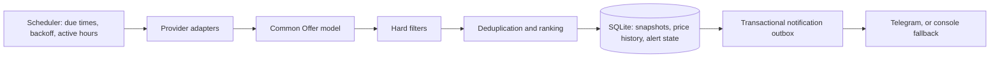

# Travel Deal Agent

A small, local Python application that watches Polish tour-operator websites for package
holidays matching a configurable budget, departure airport and hotel-quality policy. It
keeps a price history in SQLite, classifies how attractive each matching offer is, and
sends one compact Telegram message per meaningful event -- a new offer, a price drop, a
new historical low or an offer that came back -- instead of repeating the same deal.

It is designed to run unattended on a single Windows computer (Windows Task Scheduler,
no console window), without cloud infrastructure, paid APIs or a web framework.

## Key features

- **One policy, many sources.** Every provider is normalized into a common `Offer`
  model; all business rules live in `config.json`, not in the adapters.
- **Party of 2 adults**, budget per person (default: at most 1500 PLN, inclusive).
- **Airport preference** with a strong Łódź (LCJ) preference, then Warsaw (WAW/WMI,
  equal), Katowice (KTW) and Wrocław (WRO).
- **Hotel quality rules:** minimum star rating, provider ratings kept on their **native
  scales** (e.g. ITAKA 1-6, Wakacje.pl 0-10) with price-dependent thresholds, and meal
  (board) rules per price band.
- **Attractiveness category** shown in every alert: 🔥 HOT, 👍 GOOD or ✓ MATCH.
- **Price history and price events:** `NEW`, `PRICE_DROP`, `NEW_LOW` and `RETURNED`, with a
  configurable noise floor so a 1 PLN change never pages anyone.
- **Telegram notifications** via the official Bot API (plain HTTPS, no third-party
  library), with a console/log fallback for development.
- **Climate context:** a typical daytime temperature for the destination and month.
- **Scheduler** with per-provider intervals (optionally randomized), active hours,
  per-provider error isolation and exponential backoff; notification delivery retries
  with bounded backoff through a transactional outbox.
- **Respectful access:** `robots.txt` is checked before scanning, with request budgets,
  request gaps, cycle deadlines and fail-closed handling of blocks or unexpected pages.

## Provider status

| Provider | Status | Access method | Price used for alerts |
| --- | --- | --- | --- |
| Wakacje.pl (`wakacje.pl`) | **Active** | Plain HTTP listing pages, robots-checked | Listing price, shown with an explicit "unconfirmed" disclaimer |
| ITAKA (`itaka`) | **Active** | Plain HTTP listing + public offer-detail response, robots-checked | Confirmed operator booking price (incl. mandatory TFG/TFP fees) |
| TUI (`tui`) | **Active** | robots check over HTTP, then headless Chromium that passively observes TUI's own search results; offer detail page for real-time price confirmation | Confirmed real-time price only |
| Rainbow (`rainbow`) | **Blocked by source policy, disabled** | -- | -- |

Rainbow: `r.pl/robots.txt` disallows the search path that the production flow needs.
The adapter is kept in the codebase (tested offline only) in case an allowed access path
appears, but `providers.rainbow.enabled` must stay `false`, and the CLI refuses `--watch`
while it is enabled. This project does not work around robots rules.

A fictional `mock` provider exists for offline demos and tests.

## Architecture



The attractiveness category and the message text are computed from the stored offer
snapshot when a notification is rendered, independent of the transport.

| Module | Responsibility |
| --- | --- |
| `config.py`, `config_types.py` | Typed JSON configuration, `.env`/environment overrides, strict startup validation |
| `models.py` | `Offer` dataclass, Decimal prices, conservative duplicate identity |
| `providers/` | One adapter per source, shared HTTP client, robots policy, provider registry |
| `filtering.py`, `ratings.py`, `boards.py` | Pure eligibility rules, native rating scales, board normalization |
| `ranking.py`, `attractiveness.py` | Internal ranking score; HOT/GOOD/MATCH classification |
| `pipeline.py` | Filter, deduplicate, rank and persist observations |
| `scheduler.py`, `active_hours.py` | Per-provider due times, backoff, active-hours gate |
| `alerts.py` | Pure price-event decisions |
| `storage.py` | SQLite snapshots, price history, provider schedules, outbox |
| `notifications.py`, `notification_content.py` | Telegram/console delivery; transport-independent message content |
| `climate.py` | Static, region-level typical temperatures per month |

### Design decisions

- **HTTP parsing where possible, a browser only where needed.** ITAKA and Wakacje.pl are
  read over plain HTTP without executing JavaScript. Only TUI uses Playwright, because its
  results are rendered client-side; the browser observes the site's own responses during
  ordinary navigation and never calls the underlying API directly.
- **Fail closed.** Unknown airports, meals, ratings or prices never pass a hard filter. A
  blocked, redirected or structurally unexpected response stops that provider's cycle
  instead of producing guessed data. An ambiguous price is never promoted to "confirmed".
- **Provider isolation.** A failing source is logged and backed off without stopping the
  other providers or notification delivery. Database errors are not disguised as source
  errors; they propagate.
- **Typed Python.** Dataclasses for the domain model, TypedDict for configuration and
  records, Pydantic (strict mode) to validate JSON at the boundary, Decimal for money, and
  mypy `--strict` over both production code and tests.
- **SQLite as the MVP store.** One local file, no ORM, no server. The snapshot and its
  alert are written in one transaction.
- **No unnecessary infrastructure.** A sequential scheduler is enough for a few sources
  polled every few minutes; there is no web server, message broker or task queue.
- **Injected dependencies.** Providers, transports, clocks and notifiers are injected, so
  every part is tested without network access.

## Filtering, scoring and alerts

1. **Hard filters** (all must pass): 2 travelers; price per person within
   `filters.max_price`; a confirmed complete price (Wakacje.pl is the only source whose
   listing price is accepted, via `filters.accept_incomplete_price_from`); departure
   airport in `filters.airports`; at least `filters.min_stars` stars (3); provider rating
   rule; board rule; optional `min_nights`/`max_nights` (currently unrestricted).
2. **Provider rating rules** keep native scales:

   | Source | Native scale | Below 1000 PLN/person | 1000-1500 PLN/person |
   | --- | --- | --- | --- |
   | `itaka` | 1-6 | at least 4.0 | at least 5.0 |
   | `wakacje.pl` | 0-10 | at least 8.0 | at least 8.0 |
   | `tui` | 1-5 (TripAdvisor) | no hard threshold (used for ranking/attractiveness) | same |
   | `rainbow` (disabled) | 0-6 | at least 5.0 | at least 5.0 |

3. **Board rules.** Canonical boards are RO, BB, ZO, HB, FB, AI and UAI (shown as e.g.
   "Śniadania i obiadokolacje (HB)" or "Ultra All Inclusive (UAI)"). An offer needs a board
   listed in `filters.allowed_boards` **and** at least the minimum board of its price band
   in `filters.board_price_bands` (below 1000 PLN: BB; 1000-1500 PLN: HB). With the
   committed configuration (`allowed_boards`: HB, FB, AI, ZO) this means ZO/HB/FB/AI below
   1000 PLN and HB/FB/AI from 1000 PLN. UAI is a recognized, ranked board, but it is not in
   the committed `allowed_boards`, so UAI offers are filtered out until `"UAI"` is added
   there. RO and unknown boards always fail.
4. **Ranking** (internal sort order only, never shown): weighted price, airport priority,
   native rating, review count, stars and board.
5. **Attractiveness** (shown in the message header) looks at four areas -- value (price per
   person per night), hotel quality (normalized rating), airport (LCJ strong) and board
   (AI/UAI strong). 🔥 HOT needs at least two strong areas and no weak one; 👍 GOOD needs at
   least one strong area and at most one weak one; everything else is ✓ MATCH. Thresholds
   live in the `attractiveness` section of `config.json`.
6. **Price events** per offer:

   | Message header | Event | Meaning |
   | --- | --- | --- |
   | `NOWA` | `new_offer` | First eligible observation of this offer |
   | `↩️ WRÓCIŁA` | `returned` | Eligible again after `alert_rearm_hours` (24 h) without an eligible observation |
   | `📉 SPADEK CENY` | `price_drop` | Meaningful drop versus this offer's previous observed price |
   | `🏆 NAJNIŻSZA CENA` | `new_low` | Meaningful drop to its lowest price ever recorded |

   "Meaningful" means at least `price_drop_min_amount` (50 PLN) or `price_drop_min_percent`
   (5 %). One observation produces at most one event (`new_low` wins over `price_drop`).
   Unchanged prices, small drops and price increases update the history silently.

## Running on a new Windows computer

This section takes a fresh Windows 10/11 machine to a running agent. All commands are for
**Windows PowerShell**, run from the project folder. They use the virtual environment's
Python explicitly (`.\.venv\Scripts\python.exe`), so activating the environment is not
required.

### A. Requirements

- **Windows 10 or 11** with a normal user account (administrator rights are not needed).
- **Python 3.10 or newer**, 64-bit (CI tests 3.10 and 3.14). Install it from
  [python.org](https://www.python.org/downloads/windows/) and make sure the `py` launcher
  works: `py --version`.
- **Git**, to clone the private repository ([git-scm.com](https://git-scm.com/download/win)),
  plus a GitHub account that has access to it.
- **Internet access** for installing packages, downloading Chromium once, the travel
  sources and Telegram.
- **Playwright's Chromium build** -- required because the TUI provider uses a headless
  browser. It is installed by a command in step C; no separate Chrome/Edge installation is
  used.
- A **Telegram bot token and chat ID** (optional, but needed for phone notifications; see
  [Telegram notifications](#telegram-notifications)).

Nothing else is required: no database server, Docker, Node.js or paid service.

### B. Get the project

```powershell
cd C:\path\to
git clone <PRIVATE_REPOSITORY_URL> travel-deal-agent
cd travel-deal-agent
```

Replace `C:\path\to` with the folder where the project should live and
`<PRIVATE_REPOSITORY_URL>` with the repository's clone URL. Git asks you to sign in to
GitHub the first time, because the repository is private. Every following command is run
from this `travel-deal-agent` folder.

### C. Create the virtual environment and install

```powershell
py -m venv .venv
.\.venv\Scripts\python.exe -m pip install -r requirements-dev.txt
.\.venv\Scripts\python.exe -m playwright install chromium
```

- `requirements-dev.txt` installs the runtime dependencies plus pytest, Ruff and mypy
  (needed for the offline test in step F). A runtime-only machine can use
  `requirements.txt` instead. On Windows, `tzdata` is installed automatically.
- `playwright install chromium` downloads the browser into the **current Windows user's**
  profile (`%LOCALAPPDATA%\ms-playwright`). Run it as the same user that will run the
  scheduled task.
- Upgrading pip first is not required. If `py` is not found, use
  `python -m venv .venv` instead.
- Optional: `.\.venv\Scripts\Activate.ps1` activates the environment for interactive work.
  If PowerShell blocks it with an execution-policy error, keep using the explicit
  `.\.venv\Scripts\python.exe` paths shown here.

### D. Configuration

The business configuration is the committed `config.json` in the project root; there is no
separate template to copy. Edit it with any text editor; the file is strictly validated at
startup, so a typo or unknown key stops the program with a `Configuration error`. The most
common settings are listed in [Configuration](#configuration).

Machine-local settings and secrets go in `.env`, created from the example:

```powershell
Copy-Item .env.example .env
```

`.env.example` contains the database path, log level and config file name with working
defaults. You do not need to change anything there for a normal installation.

### E. Telegram secrets

Open `.env` and set both values (remove the leading `#`):

```dotenv
TELEGRAM_BOT_TOKEN=<your-bot-token>
TELEGRAM_CHAT_ID=<your-chat-id>
```

- Both must be set together; setting only one is a configuration error. With both unset,
  alerts are only written to the log (`Notifications: console`).
- Variables already set in Windows take precedence over `.env`.
- `.env` is ignored by Git. **Never commit it**, and never paste the token into
  `config.json`, the README, an issue or a screenshot.

See [Telegram notifications](#telegram-notifications) for how to obtain the two values.

> Tip: do the offline smoke test in step F **before** adding the Telegram secrets, so its
> fictional demo offers are not sent to your phone.

### F. First smoke test (no live requests)

1. Run the offline test suite. It blocks network sockets and browser start-up, so it never
   contacts a travel site or Telegram:

   ```powershell
   .\.venv\Scripts\python.exe -m pytest -q
   ```

   Every test should pass.

2. Optionally run the application itself against the fictional `mock` provider only, using
   a temporary configuration and a separate database so the real history is untouched:

   ```powershell
   New-Item -ItemType Directory -Force data | Out-Null
   $cfg = Get-Content config.json -Raw | ConvertFrom-Json
   foreach ($p in $cfg.providers.PSObject.Properties) { $p.Value.enabled = ($p.Name -eq "mock") }
   $cfg | ConvertTo-Json -Depth 20 | Set-Content data\smoke-config.json -Encoding utf8
   $env:TDA_CONFIG = "data\smoke-config.json"; $env:TDA_DATABASE = "data\smoke.sqlite3"
   .\.venv\Scripts\python.exe -m travel_deal_agent --force
   Remove-Item Env:TDA_CONFIG, Env:TDA_DATABASE
   Remove-Item data\smoke-config.json, data\smoke.sqlite3
   ```

   Expected output: `Checking provider mock`, `Provider mock matched 3 offers`, three
   demo alerts and `MOCK DATA - not real travel offers`.

**Important:** a normal run with the committed `config.json` contacts the real sources
immediately (ITAKA, Wakacje.pl and TUI are enabled), unless the current time is outside
active hours.

### G. Manual run (one check)

```powershell
.\.venv\Scripts\python.exe -m travel_deal_agent --force
```

This performs one live check of every enabled provider and exits. `--force` ignores the
saved per-provider due times and active hours; without it, a single run only scans
providers whose next run is due (on a fresh database: all of them). Output goes to the
terminal and to `logs\agent.log`.

### H. Continuous mode

```powershell
.\.venv\Scripts\python.exe -m travel_deal_agent --watch
```

The scheduler keeps running, scans each provider when it is due and stops with Ctrl+C.
`--watch` and `--force` cannot be combined. For unattended 24/7 operation, do not keep a
terminal open; use Task Scheduler as described next. **Never run two agents against the
same database at the same time** -- the application itself holds no lock.

## Running continuously on Windows (Task Scheduler)

Task Scheduler starts the agent at sign-in with `pythonw.exe`, the console-less Python
included in every Windows virtual environment. No `.bat`/`.ps1` helper is needed.

Below, `C:\path\to\travel-deal-agent` stands for **your** project folder -- replace it
everywhere.

### Create the task

1. Press the Windows key, type **Task Scheduler** and open it.
2. In the right-hand **Actions** pane, click **Create Task…** (not "Create Basic Task",
   which hides options needed below).
3. **General** tab:
   - Name: `Travel Deal Agent`
   - User account: your own account (the default shown under "When running the task, use
     the following user account").
   - Select **Run only when user is logged on**.
   - Leave **Run with highest privileges** unchecked.
4. **Triggers** tab → **New…**:
   - Begin the task: **At log on**
   - Settings: **Specific user** -- your account.
   - **Enabled** checked; no repetition.
5. **Actions** tab → **New…**:
   - Action: **Start a program**
   - Program/script: `C:\path\to\travel-deal-agent\.venv\Scripts\pythonw.exe`
   - Add arguments (optional): `-m travel_deal_agent --watch`
   - Start in (optional): `C:\path\to\travel-deal-agent`

   **Start in is required in practice**, even though Windows labels it optional: without
   it, Python cannot find the `travel_deal_agent` package and exits immediately.
6. **Conditions** tab -- uncheck:
   - Start the task only if the computer is idle for
   - Start the task only if the computer is on AC power
   - Stop if the computer switches to battery power
   - Wake the computer to run this task
   - Start only if the following network connection is available
7. **Settings** tab:
   - **Allow task to be run on demand**: checked
   - **Run task as soon as possible after a scheduled start is missed**: unchecked
   - **If the task fails, restart every**: 1 minute; **Attempt to restart up to**: 3 times
   - **Stop the task if it runs longer than**: **unchecked** (Windows pre-selects 3 days,
     which would kill the agent)
   - **If the running task does not end when requested, force it to stop**: checked
   - **If the task is already running, then the following rule applies**:
     **Do not start a new instance** -- this is what prevents two agents from writing to
     the same database.
8. Click **OK**. With "Run only when user is logged on", no password is stored.

### Start it for the first time

In **Task Scheduler Library**, select **Travel Deal Agent** and click **Run** in the right
pane. The status changes to **Running** (press F5 to refresh). No window appears -- that is
expected with `pythonw.exe`. Wait a minute or two and [check the log](#check-that-the-agent-is-working).

From now on the agent starts automatically every time you sign in to Windows. It does not
run while the computer is asleep, shut down or signed out, and the task does not wake the
computer.

### Stop and start again

- **Stop:** Task Scheduler → Task Scheduler Library → select **Travel Deal Agent** →
  **End**. The status returns to **Ready**.
- **Start again:** select the task → **Run**.

### Restart after a code or configuration change

The running process reads its code, `config.json` and `.env` only at start-up. After you:

- update the code (for example `git pull`),
- edit `config.json`, or
- change `.env` / Telegram secrets or other environment variables,

restart the task: **End**, then **Run**. Reinstalling is not needed. Run
`.\.venv\Scripts\python.exe -m pip install -r requirements-dev.txt` again only if an update
changed `requirements.txt` or `requirements-dev.txt`.

### Active hours

The committed configuration scans only between **07:00 and 23:30 (Europe/Warsaw)**:

```json
"active_hours": {
  "enabled": true,
  "timezone": "Europe/Warsaw",
  "active_from": "07:00",
  "active_until": "23:30"
}
```

Outside this window the process stays alive but makes no requests; when the window opens
it runs one normal check of each due provider, not a burst of missed scans. `active_from`
is inclusive, `active_until` exclusive, windows may wrap past midnight, and
`"enabled": false` scans at any hour. `--force` bypasses the window for one manual run.

## Check that the agent is working

Logs are written to `logs\agent.log` in the project folder (created automatically, rotated
at about 2 MB with up to three backups, `agent.log.1`..`agent.log.3`). Timestamps are local
time. From the project folder:

```powershell
# Last 40 lines
Get-Content .\logs\agent.log -Tail 40

# Most recent start of the program
Select-String -Path .\logs\agent.log -Pattern "Notifications:" | Select-Object -Last 1

# Recent errors
Select-String -Path .\logs\agent.log -Pattern " ERROR " | Select-Object -Last 5
```

What normal operation looks like:

| Log line | Meaning |
| --- | --- |
| `Notifications: telegram` / `Notifications: console` | The program started; shows the delivery channel |
| `Search started` ... `Search finished in ...s; N unique matches` | One scheduler pass. In `--watch` mode passes repeat about every 30 s (`scheduler.idle_poll_seconds`), most of them with no provider due; `0 unique matches` is normal |
| `Checking provider tui` → `Provider tui fetched N offers` → `Provider tui matched N offers` | A real scan of one provider (same for `itaka` and `wakacje.pl`) |
| `Outside active hours; skipping provider scans` | Night-time idling, expected |
| `Provider ... failed; retry in ...s` | That source failed; it backs off and retries later, others continue |
| `Notification ... failed; will retry later` | Telegram delivery failed; the alert stays queued |

With Telegram configured, alerts go to the chat and do not appear in the log; with the
console fallback, the full alert text is logged.

**Task Scheduler:** the task's **Status** column shows **Running** while the agent runs;
**Last Run Result** `0x41301` means "currently running". `(0x2)` means the program exited
with a configuration or command-line error.

**Task Manager** (Details tab): a running agent normally shows **two** `pythonw.exe`
processes. The virtual environment's `pythonw.exe` is a small launcher that starts the real
interpreter as a child process; this is not a duplicate agent. After **End**, both should
disappear.

## Moving to another computer

Do **not** copy these from the old machine -- they are machine-specific or regenerated:

- `.venv\` (contains absolute paths to the old Python installation)
- `__pycache__\`, `.pytest_cache\`, `.mypy_cache\`, `.ruff_cache\`
- `logs\`
- diagnostic folders under `data\` (for example browser capture or recon artifacts)

Instead, on the new computer: clone the repository, create a new `.venv`, install the
dependencies and Chromium, create `.env` with the Telegram secrets (transfer them
privately, not through the repository), review `config.json` and create the Task Scheduler
task -- that is, follow [Running on a new Windows computer](#running-on-a-new-windows-computer)
and the Task Scheduler section.

The price history lives in one SQLite database, `data\offers.sqlite3` (configurable with
`TDA_DATABASE`). Choose one of two options:

**A. New history.** Do not copy the database. The agent creates an empty one on first
start. Every currently matching offer is then treated as new, so expect a first wave of
`NOWA` alerts, and price-drop detection starts from zero.

**B. Keep price history.**

1. **Stop the agent on both computers** (Task Scheduler → End; confirm no `pythonw.exe`
   is left in Task Manager).
2. On the old computer, copy `data\offers.sqlite3`.
3. The application uses SQLite's default rollback journal, not WAL, so there are no
   `-wal`/`-shm` files and, once the agent is stopped, `offers.sqlite3` alone is the
   complete database. If an `offers.sqlite3-journal` file is present next to it, the last
   write was interrupted: do not delete it -- start and stop the agent once on the old
   computer so SQLite recovers the database, then copy `offers.sqlite3`.
4. On the new computer, place the file at `data\offers.sqlite3` in the project folder
   (create `data` if needed) **before** the agent's first start there.
5. Start the task on the new computer only. Never run both computers' agents with
   copies of the same history and the same Telegram chat at the same time, or you will
   receive duplicate alerts.

## Configuration

All business rules are in `config.json` (strictly validated; unknown keys and wrong types
are rejected). Prices are strings in PLN per person. After any change, restart the agent.

| What | Where in `config.json` |
| --- | --- |
| Maximum price per person | `filters.max_price` (e.g. `"1500"`) |
| Number of travelers | `filters.people` (the adapters and alerts assume 2) |
| Allowed departure airports | `filters.airports` |
| Airport preference (ranking) | `ranking.airport_priority` and `ranking.airport_groups` (LCJ first, WAW/WMI equal) |
| Airport preference (attractiveness) | `attractiveness.airport.strong` / `.normal` |
| Minimum hotel stars | `filters.min_stars` |
| Stay length | `filters.min_nights` / `filters.max_nights` (`null` = unrestricted) |
| Provider rating thresholds | `filters.provider_ratings.<provider>` |
| Boards | `filters.allowed_boards`, `filters.board_price_bands` |
| Listing prices accepted without confirmation | `filters.accept_incomplete_price_from` |
| Enable/disable a provider | `providers.<provider>.enabled` |
| Scan interval | `providers.<provider>.interval_seconds`, or a randomized range with both `interval_min_seconds` and `interval_max_seconds` |
| Per-provider request limits | `max_pages`, `max_requests`, `max_detail_requests`, `timeout_seconds`, `cycle_seconds`, `request_gap_seconds` (keys differ slightly per provider) |
| Scheduler idle polling / backoff cap | `scheduler.idle_poll_seconds`, `scheduler.max_backoff_exponent` |
| Active hours | `active_hours` |
| Price-event noise floor | `price_drop_min_amount`, `price_drop_min_percent` |
| Re-announce after absence | `alert_rearm_hours` |
| Attractiveness thresholds | `attractiveness` |
| Optional external hotel ratings | `external_verification` (disabled; Google/Tripadvisor adapters are offline placeholders) |

Provider IDs are `itaka`, `wakacje.pl`, `tui`, `rainbow` (keep disabled) and `mock`. With
the committed values, ITAKA is scanned every 8-15 minutes (random range) and Wakacje.pl and
TUI every hour. After a failure, the next attempt waits
`interval_seconds * 2**failures` (exponent capped by `scheduler.max_backoff_exponent`).

Settings read from `.env` or the Windows environment (Windows variables win):

| Variable | Default | Purpose |
| --- | --- | --- |
| `TELEGRAM_BOT_TOKEN`, `TELEGRAM_CHAT_ID` | unset | Telegram delivery; both or neither |
| `TDA_CONFIG` | `config.json` | Configuration file, relative to the project folder |
| `TDA_DATABASE` | `data/offers.sqlite3` | SQLite database path, relative to the project folder |
| `TDA_LOG_LEVEL` | `INFO` | `DEBUG`, `INFO`, `WARNING`, `ERROR` or `CRITICAL` |
| `ITAKA_MAX_PAGES` | unset | Optional override of `providers.itaka.max_pages` |

## Telegram notifications

Telegram is the notification channel. `TelegramNotifier` sends each alert through the
official Bot API `sendMessage` call using the standard library; the token is never logged.

To obtain the two values:

1. In Telegram, open **@BotFather**, send `/newbot` and follow the prompts. BotFather replies
   with the **bot token**.
2. Open a chat with your new bot and send it any message.
3. In a browser, open `https://api.telegram.org/bot<your-bot-token>/getUpdates` and find
   `"chat":{"id": ...}` -- that number is the **chat ID**. This URL contains your token; do
   not share or screenshot it.
4. Put both values in `.env` ([step E](#e-telegram-secrets)) and restart the agent. The log
   should show `Notifications: telegram`.

A failed delivery never stops scanning: the notification stays in the SQLite outbox and is
retried with bounded exponential backoff, and is abandoned (but kept for inspection) after
a maximum number of attempts.

Example message (fictional offer):

```text
🔥 NOWA • Szczególnie ciekawa
🏨 Meridian ★★★★ • Bułgaria • Słoneczny Brzeg
⭐ 8,0/10 🍽 Śniadania i obiadokolacje (HB)
💰 1393 zł/os. (2786 zł / 2 osoby) • 199 zł/os./noc
🛫 Warszawa • 8 dni / 7 nocy
📅 18.05 (wtorek) – 25.05.2027 (wtorek)
☀️ Typowo w maju: ok. 22°C

🔗 Zobacz ofertę
ℹ️ Cena z listingu — niepotwierdzona.
```

Price events add the previous price and the size of the drop. When a confirmed booking
total includes mandatory operator fees or known local costs, they are listed on extra lines.
Message content is transport-independent (`NotificationMessage`), so another channel
(Discord is the preferred candidate after the MVP) would only need a new `Notifier`.
WhatsApp is not planned.

## Tests and quality

```powershell
.\.venv\Scripts\python.exe -m pytest -q
.\.venv\Scripts\python.exe -m ruff check .
.\.venv\Scripts\python.exe -m ruff format --check .
.\.venv\Scripts\python.exe -m mypy
```

- 1400+ automated tests covering policy boundaries, rating scales, board rules, ranking,
  deduplication, parsing of saved provider fixtures, price events, persistence across
  restarts, notification retries, scheduling and provider failure isolation.
- Tests never touch the network: sockets and browser start-up are blocked, SQLite
  databases are temporary, and clocks and transports are injected.
- mypy runs in strict mode on production code **and** tests; Ruff checks lint and
  formatting (configuration in `pyproject.toml`).
- `.github/workflows/quality.yml` runs the same checks on Windows and Linux with Python
  3.10 and 3.14 when the repository is hosted on GitHub.
- Files under `experiments/` are earlier reconnaissance and proofs of concept; they are not
  part of the production package or of the `pytest -q` gate.

## Troubleshooting

- **Status stays Ready after Run, or returns to Ready quickly.** Check the task's
  Program/script and Start in paths. A `Last Run Result` of `(0x2)` means a configuration
  or command-line error. These errors happen **before** logging starts, so they are not in
  `agent.log` and `pythonw.exe` shows nothing. End the task, then run
  `.\.venv\Scripts\python.exe -m travel_deal_agent --watch` in a terminal to see the
  message, fix it, press Ctrl+C and start the task again.
- **`No module named travel_deal_agent`.** The Start in field is empty or points to the
  wrong folder.
- **TUI fails with a missing browser executable.** Run
  `.\.venv\Scripts\python.exe -m playwright install chromium` as the same Windows user that
  runs the task.
- **`Notifications: console` although Telegram is configured.** Both variables must be set
  in `.env` without a leading `#`, and the agent must be restarted.
- **The log is not changing.** Confirm the task is Running and `pythonw.exe` is in Task
  Manager. Outside active hours only short idle lines are written.
- **Project folder moved or `.venv` recreated.** Update Program/script and Start in in the
  task's Actions tab to the new paths.

## Known limitations

- **Rainbow is blocked by source policy** (robots.txt) and stays disabled.
- **Disappeared offers are not reported.** Scans are staggered and retried independently,
  so there is no safe "complete successful scan" signal to tell a real disappearance from a
  transient miss yet; `RETURNED` relies only on the per-offer re-arm window.
- **Coverage is partial by design.** Each cycle reads a bounded number of pages and makes
  few detail requests (for example one ITAKA/TUI price confirmation per cycle), so not
  every offer of a source is seen or confirmed.
- **Wakacje.pl prices are listing prices**, marked as unconfirmed in every message.
- **Independent hotel ratings are not connected.** Google/Tripadvisor verification exists
  only as an interface with offline placeholders; ratings come from each provider.
- **Conservative deduplication.** The same trip sold by two providers, or with slightly
  different hotel spelling, may produce separate alerts rather than risk merging different
  trips.
- **Local Windows deployment.** The agent runs only while the computer is on and the user
  is signed in; there is no built-in single-instance lock (Task Scheduler provides it).
- **At-least-once delivery.** A crash between sending a Telegram message and recording it
  can repeat that message once.
- **Climate data is static** and region-level; unrecognized destinations simply omit the
  line.
- **No schema migrations** beyond small in-place column additions; the database is a local
  MVP store.

## Respectful access and safety

- `robots.txt` is fetched and honored before scanning; a missing or unreadable robots file
  stops the cycle. Crawl-delay can only make requests slower.
- Every provider has a request budget, a minimum gap between requests, a timeout and a
  cycle deadline. Scan intervals are minutes to hours, not seconds.
- HTTP requests identify themselves (`TravelDealAgent/0.1`), send no cookies and do not
  follow redirects. The TUI browser session is fresh for each scan, headless, and only
  navigates TUI's public pages.
- HTTP 403/429, redirects, challenge pages or unexpected structure stop that provider's
  cycle (fail closed); the project never bypasses CAPTCHAs, logins or robots rules.
- No paid APIs, no credentials other than your own Telegram bot, and no personal data is
  collected. Secrets live only in `.env`, which is excluded from Git together with
  databases, logs and caches.

## Provider notes

**Wakacje.pl.** Reads listing pages over plain HTTP, without JavaScript. The adapter has no
detail-confirmation stage, so its prices always stay unconfirmed; the source is explicitly
listed in `filters.accept_incomplete_price_from` and its alerts carry the "unconfirmed"
disclaimer.

**ITAKA.** Reads the last-minute listing over HTTP, then a bounded number of public offer
detail responses. A price is confirmed only when the detail data agrees with the listing
on rate, hotel, dates, room, board, flights and two adults, and its booking total
reconciles (base price plus mandatory TFG/TFP fees). Candidates that would fail any other
hard filter never receive a detail request. Local costs such as taxes or visas are kept
separately and never added to the price.

**TUI.** Opens a search results page in headless Chromium and passively reads TUI's own
search responses, up to `max_pages`; it then opens the offer page of a small number of
candidates to confirm real-time availability and price, including mandatory fees. Only
confirmed offers are eligible; everything else fails closed. TUI's TripAdvisor rating
(1-5) is used for ranking and attractiveness but has no hard threshold.

**Rainbow.** Implemented and tested offline only; disabled because of robots.txt. It is
not part of normal operation.

Background notes from the investigation of each source are in
`experiments/*/CURRENT_STATE.md`.

A `Dockerfile` and `docker-compose.yml` are also included as an optional container
setup (Playwright base image, `--watch`, bind-mounted `data/` and `logs/`); the Windows
Task Scheduler setup above is the documented primary deployment.

## Project status

Feature-complete MVP, running unattended on a local Windows machine with three active
providers (Wakacje.pl, ITAKA, TUI) and Telegram notifications. Possible next steps:
reporting disappeared offers once scan completeness can be proven, a verified independent
hotel-rating source, stronger cross-provider trip matching, and Discord as a second
channel.
