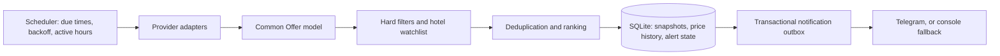

# Travel Deal Agent

An automated agent that watches Polish tour-operator websites for package holidays matching
a configurable budget, departure airport and hotel-quality policy. Every source is
normalized into one `Offer` model, ranked, stored with its price history in SQLite and
turned into compact Telegram alerts -- only for meaningful events (a new offer, a price
drop, a new historical low, an offer that came back). It runs locally on Windows or 24/7 in
Docker on a small Linux VPS.

## Goal

Finding a good last-minute deal by hand means re-running the same searches every day. This
project does that continuously and goes beyond a simple price filter: hotel quality on
each source's native rating scale, board rules per price band, airport preference (with a
strong emphasis on Łódź), price history and an attractiveness category, so an alert is
worth reading. It is a portfolio project built as a small, dependency-light Python
application rather than a framework-heavy system.

## Features

- **Sources:** Wakacje.pl, TUI and ITAKA are active; Rainbow is implemented but disabled
  (see [Provider status](#provider-status)).
- **Configurable filters:** price per person, airports, stars, stay length, boards and
  provider ratings on their native scales -- all in `config.json`, not in the adapters.
- **Scoring:** internal ranking plus a HOT / GOOD / MATCH attractiveness category.
- **Price history and events:** `NEW`, `PRICE_DROP`, `NEW_LOW`, `RETURNED`, with a noise
  floor so a 1 PLN change never pages anyone.
- **Hotel watchlist:** specific hotels with their own price cap, independent of the
  standard filters, searched directly per provider.
- **Telegram alerts** through the official Bot API (plain HTTPS), with a console fallback.
- **Google Places verification** of hotel ratings (optional, cached).
- **Climate estimate:** typical (historical, region-level) daytime temperature for the
  destination and month -- not a weather forecast.
- **Deduplication** with conservative offer identity; no fuzzy hotel matching.
- **SQLite storage** with a transactional notification outbox and bounded retries.
- **Provider isolation:** one failing source never stops the others; failures back off.
- **Respectful access:** `robots.txt` checks, request budgets, gaps and deadlines.

## Provider status

| Provider | Status | Access method | Price used for alerts |
| --- | --- | --- | --- |
| Wakacje.pl (`wakacje.pl`) | **Active** | Plain HTTP listing pages, robots-checked | Listing price, shown with an explicit "unconfirmed" disclaimer |
| ITAKA (`itaka`) | **Active** | Plain HTTP listing + public offer-detail response, robots-checked | Confirmed operator booking price (incl. mandatory TFG/TFP fees) |
| TUI (`tui`) | **Active** | robots check over HTTP, then headless Chromium that passively observes TUI's own search results; offer page for real-time price confirmation | Confirmed real-time price only |
| Rainbow (`rainbow`) | **Disabled** (blocked by source policy) | -- | -- |

Rainbow's `robots.txt` disallows the search path the production flow would need. The
adapter stays in the codebase (tested offline only) in case an allowed access path appears;
`providers.rainbow.enabled` must stay `false`, and the CLI refuses `--watch` while it is
enabled. This project does not work around robots rules. A fictional `mock` provider
exists for offline demos and tests.

## Architecture


```mermaid
flowchart LR
    Scheduler[Scheduler: due times, backoff, active hours] --> Providers[Provider adapters]
    Providers --> Offer[Common Offer model]
    Offer --> Filters[Hard filters and hotel watchlist]
    Filters --> Ranking[Deduplication and ranking]
    Ranking --> SQLite[(SQLite: snapshots, price history, alert state)]
    SQLite --> Outbox[Transactional notification outbox]
    Outbox --> Notifier[Telegram, or console fallback]
```

Each provider adapter is isolated behind the same interface and returns the common `Offer`
model; nothing downstream knows which site an offer came from except through explicit
fields. Message text is built from the stored snapshot, independent of the transport.

| Module | Responsibility |
| --- | --- |
| `config.py`, `config_types.py` | Typed JSON configuration, `.env`/environment overrides, strict startup validation |
| `models.py` | `Offer` dataclass, Decimal prices, conservative duplicate identity |
| `providers/` | One adapter per source, shared HTTP client, robots policy, provider registry |
| `filtering.py`, `watchlist.py`, `ratings.py`, `boards.py` | Pure eligibility rules, hotel watchlist matching, native rating scales, board normalization |
| `ranking.py`, `attractiveness.py` | Internal ranking score; HOT/GOOD/MATCH classification |
| `pipeline.py` | Filter, deduplicate, rank and persist observations |
| `scheduler.py`, `active_hours.py` | Per-provider due times, backoff, active-hours gate |
| `alerts.py` | Pure price-event decisions |
| `storage.py` | SQLite snapshots, price history, provider schedules, outbox |
| `notifications.py`, `notification_content.py` | Telegram/console delivery; transport-independent message content |
| `climate.py` | Static, region-level typical temperatures per month |

### Design decisions

- **HTTP parsing where possible, a browser only where needed.** ITAKA and Wakacje.pl are
  read over plain HTTP. Only TUI uses Playwright, because its results are rendered
  client-side; the browser observes the site's own responses during ordinary navigation and
  never calls the underlying API directly.
- **Fail closed.** Unknown airports, meals, ratings or prices never pass a hard filter. A
  blocked, redirected or unexpected response stops that provider's cycle instead of
  producing guessed data. An ambiguous price is never promoted to "confirmed".
- **Failure isolation.** A failing source is logged and backed off without stopping the
  others or notification delivery. A failing polling cycle (for example a locked database)
  is logged and retried with backoff instead of ending the process.
- **Typed Python.** Dataclasses for the domain model, TypedDict for configuration and
  records, Pydantic (strict mode) to validate JSON at the boundary, Decimal for money, and
  mypy `--strict` over production code and tests.
- **No unnecessary infrastructure.** SQLite, a sequential scheduler and injected clocks,
  transports and notifiers are enough; there is no web server, broker or ORM.

## Tech stack

Python 3.10+, Pydantic, Playwright (TUI only), stdlib HTTP and HTML parsing, SQLite,
pytest, Ruff, mypy (strict), Docker Compose.

## Filtering, scoring and alerts

1. **Hard filters** (all must pass): 2 travelers; price per person within
   `filters.max_price` (committed default: 1500 PLN); a confirmed complete price (Wakacje.pl
   is the only source whose listing price is accepted, via
   `filters.accept_incomplete_price_from`); departure airport in `filters.airports`; at
   least `filters.min_stars` stars; provider rating rule; board rule; optional
   `min_nights`/`max_nights`.
2. **Provider rating rules** keep native scales:

   | Source | Native scale | Below 1000 PLN/person | 1000-1500 PLN/person |
   | --- | --- | --- | --- |
   | `itaka` | 1-6 | at least 4.0 | at least 5.0 |
   | `wakacje.pl` | 0-10 | at least 8.0 | at least 8.0 |
   | `tui` | 1-5 (TripAdvisor) | no hard threshold (used for ranking/attractiveness) | same |
   | `rainbow` (disabled) | 0-6 | at least 5.0 | at least 5.0 |

3. **Board rules.** Canonical boards are RO, BB, ZO, HB, FB, AI and UAI. An offer needs a
   board listed in `filters.allowed_boards` **and** at least the minimum board of its price
   band in `filters.board_price_bands`. RO and unknown boards always fail.
4. **Ranking** (internal sort order only): weighted price, airport priority, native rating,
   review count, stars and board.
5. **Attractiveness** (shown in the message header) looks at value (price per person per
   night), hotel quality, airport (LCJ strong) and board (AI/UAI strong). HOT needs at least
   two strong areas and no weak one; GOOD needs at least one strong area and at most one
   weak one; everything else is MATCH. Thresholds live in `attractiveness` in `config.json`.
6. **Price events** per offer:

   | Message header | Event | Meaning |
   | --- | --- | --- |
   | `NOWA` | `new_offer` | First eligible observation of this offer |
   | `↩️ WRÓCIŁA` | `returned` | Eligible again after `alert_rearm_hours` (24 h) without an eligible observation |
   | `📉 SPADEK CENY` | `price_drop` | Meaningful drop versus this offer's previous observed price |
   | `🏆 NAJNIŻSZA CENA` | `new_low` | Meaningful drop to its lowest price ever recorded |

   "Meaningful" means at least `price_drop_min_amount` (50 PLN) or `price_drop_min_percent`
   (5 %). One observation produces at most one event (`new_low` wins over `price_drop`).
   Unchanged prices, small drops and price increases update the history silently.

## Two ways to run it

The agent is a long-running process. Two supported setups exist; the detailed
instructions live in separate documents.

### Option 1 -- Windows Task Scheduler (local / development)

The agent runs as a background process started by Windows Task Scheduler at sign-in
(`pythonw.exe`, no console window) and polls on its configured cadence. It only runs while
the computer is on and the task is active. Good for development, testing and simple local
use. Step-by-step setup: [docs/WINDOWS_SETUP.md](docs/WINDOWS_SETUP.md).

- **Pros:** simplest setup, no server, no VPS administration.
- **Cons:** depends on a laptop and Windows; sleep, restarts or network loss interrupt it;
  not a real 24/7 option; moving to another machine needs manual migration.

### Option 2 -- Docker + Oracle Cloud VPS (target 24/7)

The agent runs as a single Docker Compose service (`restart: unless-stopped`) on an Ubuntu
ARM64 VPS, independent of any laptop. `data/` and `logs/` are persistent bind mounts;
secrets and personal configuration (`.env`, `hotel_watchlist.json`) are provided on the
server and never committed. The configuration is prepared for Oracle Cloud's Free
Tier / Always Free offering; no free tier is guaranteed, so check current limits and
eligibility in the OCI console. Full guide: [DEPLOYMENT.md](DEPLOYMENT.md).

- **Pros:** runs 24/7 independently of a laptop; reproducible environment; automatic
  container restart; easier to maintain as a deployment.
- **Cons:** more technical setup; you maintain SSH, the VPS and Docker; you must watch
  resource, cost and Oracle limits; secrets must be configured on the server.

| | Windows Task Scheduler | Docker + Oracle VPS |
| --- | --- | --- |
| Best for | Local / development | 24/7 operation |
| Requires a laptop | Yes | No |
| Setup | Easier | More technical |
| Environment isolation | Lower | Strong |
| Restart behaviour | Windows-dependent | Docker restart policy |
| Recommended for production | No / limited | Yes |

Run **only one** of them against a given Telegram chat: after the VPS goes live, disable
the Windows task, or you get duplicate scans and duplicate alerts.

## Quick start (local)

```powershell
py -m venv .venv
.\.venv\Scripts\python.exe -m pip install -r requirements-dev.txt
.\.venv\Scripts\python.exe -m playwright install chromium
Copy-Item .env.example .env
.\.venv\Scripts\python.exe -m pytest -q
.\.venv\Scripts\python.exe -m travel_deal_agent --force   # one live check, then exit
.\.venv\Scripts\python.exe -m travel_deal_agent --watch   # continuous mode, Ctrl+C to stop
```

A normal run contacts the real sources (ITAKA, Wakacje.pl and TUI are enabled) unless it
is outside the configured active hours. Without Telegram variables, alerts are only
logged. On Linux/macOS use `python` from the virtual environment with the same arguments.

## Configuration

| File | Purpose | In Git |
| --- | --- | --- |
| [`config.json`](config.json) | All business rules: filters, provider cadence and budgets, rating scales, scoring, active hours. Strictly validated at startup. | Yes |
| [`.env`](.env.example) | Secrets and machine-local settings; create it from `.env.example`. | **No** (ignored) |
| `hotel_watchlist.json` | Personal watched hotels; create it from [`hotel_watchlist.example.json`](hotel_watchlist.example.json). | **No** (ignored) |

Secrets are never committed. After any change, restart the agent: it reads code,
configuration and `.env` only at start-up.

| What | Where in `config.json` |
| --- | --- |
| Maximum price per person | `filters.max_price` |
| Allowed departure airports / preference | `filters.airports`, `ranking.airport_priority`, `attractiveness.airport` |
| Minimum hotel stars, stay length | `filters.min_stars`, `filters.min_nights` / `max_nights` |
| Provider rating thresholds | `filters.provider_ratings.<provider>` |
| Boards | `filters.allowed_boards`, `filters.board_price_bands` |
| Enable/disable a provider, scan interval | `providers.<provider>.enabled`, `interval_seconds` (or a randomized `interval_min_seconds`/`interval_max_seconds`) |
| Per-provider request limits | `max_pages`, `max_requests`, `max_detail_requests`, `timeout_seconds`, `cycle_seconds`, `request_gap_seconds` |
| Scheduler idle polling / backoff cap | `scheduler.idle_poll_seconds`, `scheduler.max_backoff_exponent` |
| Active hours (committed: 07:00-23:30 Europe/Warsaw) | `active_hours` |
| Price-event noise floor, re-announce window | `price_drop_min_amount`, `price_drop_min_percent`, `alert_rearm_hours` |
| Optional external hotel ratings | `external_verification` |

Environment variables (from `.env` or the process environment):

| Variable | Default | Purpose |
| --- | --- | --- |
| `TELEGRAM_BOT_TOKEN`, `TELEGRAM_CHAT_ID` | unset | Telegram delivery; both or neither |
| `GOOGLE_PLACES_API_KEY` | unset | Google Places API (New) key; unset skips Google verification |
| `TDA_CONFIG` | `config.json` | Configuration file, relative to the project folder |
| `TDA_DATABASE` | `data/offers.sqlite3` | SQLite database path, relative to the project folder |
| `TDA_LOG_LEVEL` | `INFO` | `DEBUG`, `INFO`, `WARNING`, `ERROR` or `CRITICAL` |
| `ITAKA_MAX_PAGES` | unset | Optional override of `providers.itaka.max_pages` |

## Hotel watchlist

A watched hotel is a specific property chosen in advance. It has its own price cap and
stay rules and is never subject to the global `filters.max_price` -- for example a 2300
PLN/person cap for one hotel next to the standard 1500 PLN cap. Copy
[`hotel_watchlist.example.json`](hotel_watchlist.example.json) to `hotel_watchlist.json`
and add one object per hotel:

| Field | Meaning |
| --- | --- |
| `name`, `aliases` | Hotel name as providers spell it. Matching is exact after normalizing case, accents and punctuation -- never fuzzy, so list every spelling variant as an alias. |
| `country` | Optional two-letter safeguard (e.g. `EG`). |
| `people` | Party size (targeted TUI and ITAKA searches support 2 adults). |
| `max_price_per_person` | Price ceiling per person, as a string. |
| `min_nights` / `max_nights` | Optional stay-length bounds. |
| `airports` | Accepted departure airports (IATA codes). |
| `provider_listings` | Wakacje.pl only: the hotel's own listing page URL. |
| `provider_destinations` | Search scope per provider: TUI destination code (e.g. `HRG`), ITAKA country path slug (e.g. `egipt`). |

Both provider fields are optional and specific to the hotel's resort or country; copy them
once from the provider's own site -- the project never guesses them. Hotels sharing a
destination share one query per cycle. Whatever a provider returns, the entry's own
limits are always validated before an alert is created.

## Telegram notifications

`TelegramNotifier` sends each alert through the official Bot API `sendMessage` call using
the standard library; the token is never logged. To obtain the two values:

1. In Telegram, open **@BotFather**, send `/newbot` and follow the prompts to get the
   **bot token**.
2. Open a chat with your new bot and send it any message.
3. Open `https://api.telegram.org/bot<your-bot-token>/getUpdates` in a browser and find
   `"chat":{"id": ...}` -- that is the **chat ID**. The URL contains your token; do not
   share or screenshot it.
4. Put both values in `.env` and restart the agent. The log shows `Notifications: telegram`.

A failed delivery never stops scanning: the notification stays in the SQLite outbox and is
retried with bounded exponential backoff (abandoned, but kept for inspection, after a
maximum number of attempts). When Telegram answers HTTP 429, its `retry_after` is honoured
and the rest of that delivery batch waits.

Example message (fictional offer):

```text
🔥 NOWA • Szczególnie ciekawa
🏨 Meridian ★★★★ • Bułgaria • Słoneczny Brzeg
⭐ 8,0/10 🍽 Śniadania i obiadokolacje (HB)
💰 1393 zł/os. (2786 zł / 2 osoby) • 199 zł/os./noc
🛫 Warszawa • 8 dni / 7 nocy
📅 18.05 (wtorek) – 25.05.2027 (wtorek)
☀️ Typowo w maju: ok. 22°C

🔗 Zobacz ofertę
ℹ️ Cena z listingu — niepotwierdzona.
```

Message content is transport-independent (`NotificationMessage`), so another channel
(Discord is the preferred candidate) would only need a new `Notifier`.

## Quality / Testing

```powershell
python -m pytest -q
python -m ruff check .
python -m ruff format --check .
python -m mypy
```

- Provider-specific tests built on saved parser fixtures, plus tests for policy
  boundaries, rating scales, board rules, ranking, deduplication, price events,
  persistence across restarts, notification retries, scheduling and failure isolation.
- Tests never use the network: sockets and browser start-up are blocked, SQLite databases
  are temporary, and clocks, sleep and transports are injected.
- mypy runs in strict mode on production code and tests; Ruff checks lint and formatting
  (configuration in `pyproject.toml`).
- The container image has been built and smoke-tested locally (see
  [DEPLOYMENT.md](DEPLOYMENT.md)).
- [`.github/workflows/quality.yml`](.github/workflows/quality.yml) runs the same checks on
  Windows and Linux with Python 3.10 and 3.14 when hosted on GitHub.
- `experiments/` holds reconnaissance notes and proofs of concept for each source; it is not
  part of the production package or the test gate.

## Known limitations

- **Wakacje.pl prices are listing prices**, marked as unconfirmed in every message. A price
  can change quickly and may differ once the offer page is opened; that is a source-side
  change, not a calculation error.
- **Wakacje.pl can rotate the date and price of the same offer**, which may produce several
  new-offer alerts for one hotel.
- **Targeted hotel coverage depends on provider capabilities and the configured
  destinations.** Without a `provider_destinations` entry, TUI falls back to its
  price-sorted global query and ITAKA only prioritizes hotels already present in the scanned
  pages; a scoped search can still miss a hotel not sold within the price limit.
- **Coverage is partial by design.** Each cycle reads a bounded number of pages and makes
  few detail requests, so not every offer of a source is seen or confirmed.
- **Climate data is static and region-level**; it is omitted when the destination is
  unknown or the provider sends no destination text (for example Tanzania/Zanzibar).
- **External ratings depend on Google Places** availability, the API key and the cache;
  without them ratings come from each provider.
- **Rainbow is disabled** because of its robots.txt policy.
- **At-least-once notification delivery.** A crash between sending a Telegram message and
  recording it can repeat that message once; exactly-once delivery is not possible without a
  transaction shared with Telegram.
- **Disappeared offers are not reported**, and there is **no data retention or schema
  migration** beyond small in-place column additions; the database is a local MVP store.
- **Conservative deduplication.** The same trip sold by two providers, or with different
  hotel spelling, may produce separate alerts rather than risk merging different trips.

## Respectful access and safety

- `robots.txt` is fetched and honored before scanning; a missing or unreadable robots file
  stops the cycle. Crawl-delay can only make requests slower.
- Every provider has a request budget, a minimum gap between requests, a timeout and a
  cycle deadline. Scan intervals are minutes to hours, not seconds.
- HTTP requests identify themselves (`TravelDealAgent/0.1`), send no cookies and do not
  follow redirects. The TUI browser session is fresh for each scan and headless.
- HTTP 403/429, redirects, challenge pages or unexpected structure stop that provider's
  cycle; the project never bypasses CAPTCHAs, logins or robots rules.
- No paid services are required, and no personal data is collected. Secrets live only in
  `.env`, which is excluded from Git together with databases, logs and caches.

## Provider notes

**Wakacje.pl.** Listing pages over plain HTTP; no detail-confirmation stage, so prices stay
unconfirmed and alerts carry the disclaimer.

**ITAKA.** The last-minute listing over HTTP, then a bounded number of public offer-detail
responses. A price is confirmed only when the detail data agrees with the listing on rate,
hotel, dates, room, board, flights and two adults, and its booking total reconciles (base
price plus mandatory TFG/TFP fees). Local costs such as taxes or visas are kept separately.

**TUI.** Headless Chromium passively reads TUI's own search responses, then opens the offer
page of a few candidates to confirm the real-time price, including mandatory fees. Only
confirmed offers are eligible. TripAdvisor ratings (1-5) feed ranking and attractiveness.

**Rainbow.** Implemented and tested offline only; disabled.

Background notes from the investigation of each source are in `experiments/*/`. Developer
and coding-agent rules are in [AGENTS.md](AGENTS.md).

## Project status

MVP with a production-oriented architecture: three active providers, Telegram delivery,
failure isolation, a tested Docker/VPS deployment path and strict quality gates. It is under
active development and has known limitations (see above), so it is not presented as
production-grade. Possible next steps: data retention, reporting disappeared offers once
scan completeness can be proven, stronger cross-provider trip matching and Discord as a
second channel.
